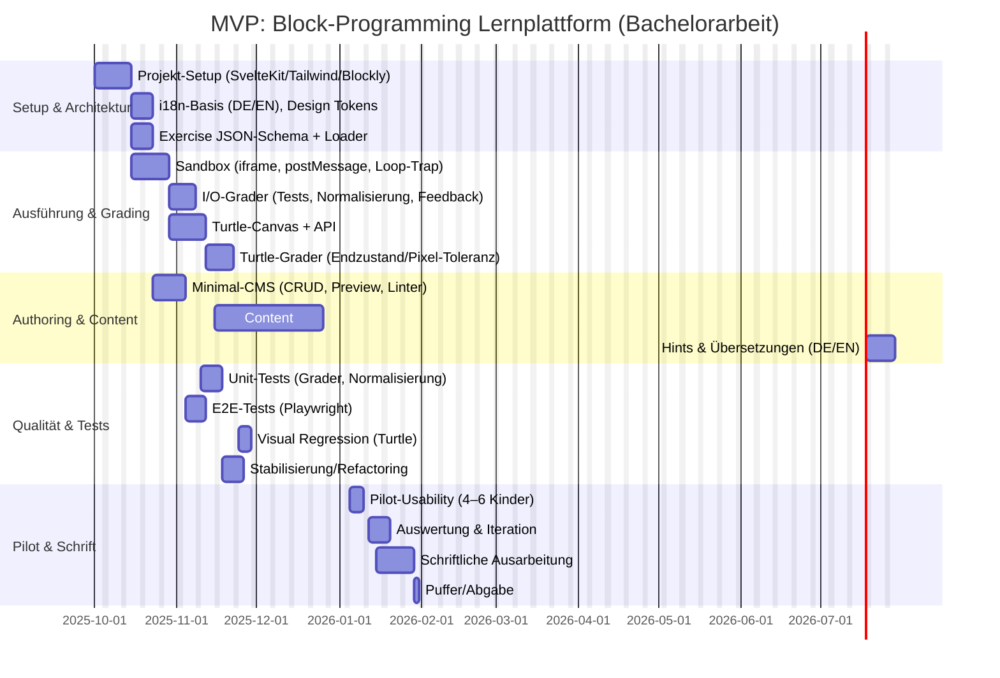

# Blockbasierte Lernplattform für 8–12 Jahre: Komplette Entwicklungs-Roadmap

Diese Markdown-Datei ist die zentrale Referenz für deine Bachelorarbeit. Sie enthält:
- Alle Requirements (funktional/nicht-funktional)
- Architektur und Designentscheidungen
- Komplette Entwicklungsschritte mit Checklisten
- Was fehlt und was wann wie gemacht werden soll
- Risiken, Testing, Evaluation
- Plan für die schriftliche Arbeit

## 1. Projektsteckbrief

### 1.1 Titel & Beschreibung

**Titel:**  
Entwurf und Implementierung einer webbasierten, blockbasierten Lernplattform mit auto-gestütztem Grading für Kinder von 8–12 Jahren

**Kurzbeschreibung:**  
Ziel ist die Konzeption und Umsetzung einer webbasierten Lernplattform, die kurze, eng gefasste Programmieraufgaben mit Block-basierten Werkzeugen anbietet. Die Plattform orientiert sich an Brilliant-ähnlichen, interaktiven Übungen und richtet sich an Kinder von 8–12 Jahren. Der MVP umfasst: zwei Aufgabentypen (I/O und Turtle-Grafik), clientseitige, sandboxed Ausführung mit Autograding, ein JSON-basiertes Autoringschema (inkl. Toolbox, Tests, Hints, Lösung) sowie mindestens 10 kuratierte Übungen zu Kernkonzepten (Variablen, Schleifen, Bedingungen, einfache Funktionen). Die Arbeit diskutiert Designentscheidungen (Blockly vs. Alternativen), Barrierefreiheit, Internationalisierung (DE/EN), Datenschutz und evaluiert die Nutzbarkeit in einem Pilot.

### 1.2 Kontext & Motivation

- **Österreich "Digitale Grundbildung"**: Seit 2022/23 Pflichtfach Sekundarstufe I
- **Problem**: Bestehende Tools (Scratch, Tynker, MakeCode) sind teils zu offen/komplex oder an Hardware/Spiele gebunden
- **Lösung**: Fokussierte, auto-gradierte Puzzles mit klarem Lernziel pro Aufgabe, einfach in Schulen deploybar (Docker)

### 1.3 Zielgruppe

- **Primär**: Kinder 8–12 Jahre (kognitive Eignung für Block-Logik, Loops, Bedingungen, Variablen)
- **Sekundär**: Lehrkräfte (Content-Erstellung, Auswertung)

### 1.4 Scope

**In Scope (MVP):**
- 10 kuratierte Übungen (Loops, Bedingungen, Variablen, einfache Funktionen)
- Zwei Aufgabentypen (I/O, Turtle/Canvas)
- Fragenpool mit Tags/Themen; Quiz-Zusammenstellung
- Minimal-CMS, JSON/DB-Schema
- Clientseitiges Autograding, Sandbox, Zeitlimits
- DE/EN-Lokalisierung
- Gastmodus (LocalStorage) oder optionale pseudonyme Accounts
- Docker-Deployment (On-Premise Schulnetz)

**Out of Scope:**
- Vollständiges Klassen-/Account-Management (Kahoot-Style)
- Komplexe Simulatoren über Turtle/2D hinaus
- SAML/SSO (nur als Research-Note)
- Freies Plugin-Entwickeln durch alle Lehrkräfte ohne Admin-Review

## 2. Requirements (UI-agnostisch, prüfbar)

### 2.1 Funktionale Requirements

#### FR-1: Fragenmodell und Metadaten
- **FR-1.1** Jede Frage hat eine eindeutige ID, Titel, Beschreibung, Altersband, Tags/Themen, Schwierigkeit (1–5), geschätzte Bearbeitungszeit.
- **FR-1.2** Jede Frage definiert eine Toolbox (Whitelist erlaubter Blöcke), ein Starter-Programm (optional), eine Referenzlösung.
- **FR-1.3** Jede Frage hat gestufte Hints (mind. 2) und Grader-Konfiguration (Typ, Tests, Normalisierung, Toleranzen).
- **FR-1.4** Alle textuellen Inhalte (Prompt, Hints, Feedbacktexte) sind in Deutsch und Englisch hinterlegbar; Fallback auf Standardsprache bei fehlenden Keys.

#### FR-2: Fragenpool, Themen, Quiz-Zusammenstellung
- **FR-2.1** Fragen liegen in einem zentralen Pool; filterbar nach Thema, Tag, Typ, Schwierigkeit, Altersband, Sprache.
- **FR-2.2** Aus dem Pool können geordnete Quizze/Lektionen erstellt werden (Liste von Fragen-IDs).
- **FR-2.3** Fragen sind wiederverwendbar in mehreren Quizzen.
- **FR-2.4** Optional: Randomisierte Auswahl aus Untermenge oder Parameter-Permutation mit Seed pro Quiz-Instanz.
- **FR-2.5** Optional: Voraussetzungen/Sequencing (Frage B erst nach Bestehen von Frage A).

#### FR-3: Autorensystem
- **FR-3.1** Autoren können Fragen erstellen, bearbeiten, klonen, archivieren.
- **FR-3.2** Versionierung: Draft/Published-Status; Änderungsprotokoll.
- **FR-3.3** Validierung beim Speichern (Linter):
  - Pflichtfelder vorhanden (Titel, Prompt, mindestens 1 Test).
  - Lokalisierung vollständig (DE/EN Keys).
  - Toolbox-Konsistenz (Starter verwendet nur erlaubte Blöcke).
  - Mindestens 1 Hidden-Test vorhanden.
- **FR-3.4** Vorschau-Modus: Autoren können Frage im Lernmodus testen und manuell graden lassen.
- **FR-3.5** Import/Export von Fragen/Quizzen als JSON (Backup, Sharing).
- **FR-3.6** Optional: Medien-Upload (Bilder, Audio) mit Metadaten (Alt-Text, Attribution).

#### FR-4: Ausführung und Sandbox
- **FR-4.1** Blöcke generieren ausführbaren Code (z. B. JavaScript) gemäß Generator pro Block-Typ.
- **FR-4.2** Ausführung in isolierter Umgebung (iframe mit `sandbox`-Attributen oder vergleichbar).
- **FR-4.3** Beschränkte API-Oberfläche; kein direkter Zugriff auf DOM/window/fetch/localStorage.
- **FR-4.4** Konfigurierbare Ressourcenlimits pro Frage:
  - Max. Laufzeit (Timeout, z. B. 2 s).
  - Endlosschleifenerkennung (Loop-Trap/Befehlszähler).
  - Max. Speicher/Befehlsanzahl/Rekursionstiefe.

#### FR-5: Autograding
- **FR-5.1** I/O-Aufgaben:
  - Mehrere Testfälle (sichtbar/hidden) mit Input/Expected-Output.
  - Normalisierung: Trim, Whitespace-Kollaps, optional Case-Insensitiv, Dezimaltrennzeichen.
  - Maschinenlesbares Feedback pro Test: pass/fail, Diff, optionaler Hint-Verweis.
- **FR-5.2** Turtle/Grafik-Aufgaben:
  - Bewertung via Kommandolog (z. B. 4× move(20), 4× turn(90)) oder Endzustand (Position/Winkel).
  - Optional: Pixelvergleich mit Toleranz (Antialiasing, Bounding-Box).
  - Zieldefinitionen pro Test (Geometrie erreicht, Target-Punkt).
- **FR-5.3** Determinismus:
  - Seeded RNG für Zufallszahlen in Tests.
  - Zeit-/Netzwerk-abhängige Funktionen verboten oder gemockt.
- **FR-5.4** Teilpunkte (optional): z. B. 3/5 Tests bestanden = 60 %.
- **FR-5.5** Ergebnis-Datenstruktur: `{ passed: boolean, score: number, tests: [{id, input, expected, actual, passed, message}] }`.

#### FR-6: Nutzer- und Rollenmanagement (leichtgewichtig)
- **FR-6.1** Rollen: Lernende, Lehrkraft, Autor, Admin.
- **FR-6.2** Registrierung/Login: minimal (E-Mail/Passwort); optional Schul-SSO als Feature-Flag.
- **FR-6.3** Fortschrittsverwaltung:
  - Pro Nutzer, Quiz, Frage: Status (not_started, attempted, passed), beste Punktzahl/Zeit, Anzahl Versuche, Hint-Nutzung.
- **FR-6.4** Gastmodus (kein Account):
  - Fortschritt lokal im Browser (LocalStorage/IndexedDB).
  - Export als JSON-Datei, Import in anderen Browser oder nach Account-Erstellung.
- **FR-6.5** Klassen/Gruppen (optional, Out-of-Scope für MVP):
  - Lehrkräfte können Gruppen anlegen, Quizze zuweisen, aggregierte Ergebnisse einsehen.

#### FR-7: Internationalisierung (i18n)
- **FR-7.1** System-UI in Deutsch und Englisch; Nutzer wählt Sprache (persistiert).
- **FR-7.2** Inhalte (Fragen, Hints) zweisprachig; fehlende Keys fallen auf Standardsprache zurück und werden geloggt.
- **FR-7.3** Lokalisierbare Datums-/Zahlenformate; Dezimaltrennzeichen im Grading konfigurierbar.
- **FR-7.4** Block-Labels mehrsprachig (via Blockly i18n-Mechanismus).

#### FR-8: Plugin- und Erweiterbarkeit
- **FR-8.1** Block-Plugin-API:
  - Neue Blöcke registrierbar mit Manifest (Name, Version, Capabilities, i18n-Labels, Inputs/Outputs).
  - Zugehöriger Codegenerator (erzeugt Sandbox-konformen Code).
  - Signiert durch Admin; SemVer, Kompatibilitätsprüfung.
- **FR-8.2** Exercise-Type-Plugin-API:
  - Neue Aufgabentypen (z. B. state-machine, robot-sim) erweiterbar.
  - Interface: `setup()`, `run(code)`, `grade(result, tests)`, `render(state)`.
- **FR-8.3** Provider-Schnittstellen:
  - Storage-Provider (LocalStorage, SQLite, Postgres).
  - Analytics-Provider (lokal, exportierbar).
  - RNG-Provider (seeded, deterministisch).
  - Optional: TTS-Provider, LLM-Provider (gemockt im Grading).
- **FR-8.4** Theme/Skins:
  - Block-Farben, Labels, Icons konfigurierbar ohne Änderung der Grader.
- **FR-8.5** Admin-Panel:
  - Plugin-Upload, Review, Aktivierung/Deaktivierung.
  - Capability-Whitelisting pro Quiz (z. B. "network:read" off für Grading).

#### FR-9: Reporting und Analytics (Basis)
- **FR-9.1** Erfassung:
  - Pro Versuch: Zeitstempel (Start/Ende), verwendete Blöcke (Anzahl/Typen), Hints geöffnet, Ergebnis.
- **FR-9.2** Export:
  - Lehrkräfte/Admins exportieren aggregierte Daten (CSV/JSON) ohne PII.
  - Pseudonymisierung/Anonymisierung für Forschungszwecke.
- **FR-9.3** Ereignisprotokoll:
  - Fehler bei Ausführung/Grading (ohne sensiblen Nutzercodeinhalt).

#### FR-10: Schnittstellen/Interoperabilität (optional, Out-of-Scope für MVP)
- **FR-10.1** REST/GraphQL-API für Fragen, Quizze, Ergebnisse (authentifiziert).
- **FR-10.2** Webhooks für Events (z. B. "Quiz abgeschlossen").
- **FR-10.3** Import-Adapter für externe Formate (z. B. QTI, H5P).

### 2.2 Nicht-funktionale Requirements

#### NFR-1: Sicherheit
- **NFR-1.1** Sandbox-Isolation: iframe mit `sandbox="allow-scripts"` oder vergleichbar; CSP-Header strikt.
- **NFR-1.2** Kein direkter DOM/window/network-Zugriff aus Schülercode.
- **NFR-1.3** Input-Validierung (XSS, Injection) auf allen Eingaben.
- **NFR-1.4** Rechteprüfung pro API-Endpunkt; Least-Privilege.
- **NFR-1.5** Security-Header: COOP, COEP, X-Frame-Options, HSTS.

#### NFR-2: Datenschutz/Compliance
- **NFR-2.1** Privacy by Default:
  - Standardbetrieb ohne personenbezogene Daten (Gastmodus).
  - Keine externen Dienste/CDNs; Assets lokal hosten.
  - IP-Logging deaktiviert oder anonymisiert (z. B. nur /24-Präfix).
  - Logs: kurze Retention (7 Tage), nur Fehler, keine PII.
- **NFR-2.2** DSGVO (falls Accounts):
  - Rechtsgrundlage (Art. 6: schulische Aufgabe/öffentliches Interesse).
  - Datenminimierung: pseudonyme IDs statt Namen/E-Mails.
  - Aufbewahrungsfristen, Lösch-/Exportfunktion (Art. 15, 17).
  - Einwilligungen (Eltern bei Minderjährigen) bei optionalen Features (z. B. Analytics).
- **NFR-2.3** Dokumentation: Datenschutz-Hinweis, ENV-Flags für Privacy-Modus.

#### NFR-3: Performance/Skalierbarkeit
- **NFR-3.1** Ressourcenbudgets:
  - Time to Interactive (TTI) < 2 s auf Referenzgerät (z. B. Schul-iPad).
  - Check/Run-Ausführung < 2 s (konfigurierbar pro Frage).
- **NFR-3.2** Clientlast leichtgewichtig: Blockly lazy-loaden, Bilder/Assets optimiert.
- **NFR-3.3** Serverseitig (falls DB): Caching für Inhalte, horizontal skalierbar (stateless API).

#### NFR-4: Zuverlässigkeit/Robustheit
- **NFR-4.1** Determinismus: Grader liefert bei wiederholter Ausführung identisches Ergebnis (Seed).
- **NFR-4.2** Fehlerisolierung: Ein fehlgeschlagener Grader-Run beeinträchtigt System nicht.
- **NFR-4.3** Wiederanlauf: Fortschrittsdaten gegen Datenverlust geschützt (Autosave, Transaktionen).

#### NFR-5: Barrierefreiheit
- **NFR-5.1** Tastaturbedienbarkeit: alle Funktionen ohne Maus erreichbar, sichtbarer Fokus.
- **NFR-5.2** Screenreader-kompatibel: ARIA-Labels, semantisches HTML, Alternativtexte für Bilder.
- **NFR-5.3** Kontraste: WCAG AA (4.5:1 normal, 3:1 groß); konfigurierbare Textgröße.
- **NFR-5.4** Altersgerechte Sprache: kurze Sätze, einfache Worte, Icons zur Unterstützung.

#### NFR-6: Wartbarkeit/Erweiterbarkeit
- **NFR-6.1** Moduläre Architektur: klare Schichten (Frontend, Sandbox, Grader, Storage).
- **NFR-6.2** Stabile APIs: Exercise-Type-API, Block-Plugin-API mit SemVer, Deprecation-Policy.
- **NFR-6.3** Tests:
  - Unit-Tests für Grader/Normalisierung ≥ 80 % Abdeckung.
  - E2E-Tests für Kernflüsse (Lösen I/O, Lösen Turtle, Quiz abschließen).
  - Optional: Visual Regression für Turtle-Canvas.
- **NFR-6.4** Dokumentation:
  - Entwickler: Setup, Architektur, Plugin-API.
  - Autoren: Frage-Design-Checkliste, JSON-Schema, Beispiele.
  - Admin: Deployment, ENV-Flags, Backup/Restore.

#### NFR-7: Kompatibilität
- **NFR-7.1** Browser-Support:
  - Desktop: Chrome/Edge ≥ 100, Firefox ≥ 100, Safari ≥ 15.
  - Mobil/Tablet: Safari iOS ≥ 15, Chrome Android ≥ 100.
- **NFR-7.2** Keine Abhängigkeit von proprietären Diensten ohne Fallback.
- **NFR-7.3** Offline-Fähigkeit (optional): PWA mit Service-Worker.

## 3. Designentscheidungen

### 3.1 Blockly vs. MakeCode

| Kriterium | Blockly | MakeCode | Entscheidung |
|-----------|---------|----------|--------------|
| Integration | Bibliothek, volle Kontrolle | Volle Plattform, schwer anzupassen | **Blockly** |
| Custom-Toolbox | Pro-Frage einfach | Kompliziert | **Blockly** |
| Autograding | Du baust Grader | Eingebaute Sims, schwer anzupassen | **Blockly** |
| CMS | Flexibel | Starr | **Blockly** |
| Block⇄Text | Du implementierst | Poliert eingebaut | MakeCode besser, aber nicht entscheidend |

**Gewählt: Blockly** – weil maximale Flexibilität für Quiz/CMS-Workflow und Custom-Grading benötigt.

### 3.2 Content-Storage

| Option | Vorteile | Nachteile | MVP |
|--------|----------|-----------|-----|
| Statische JSON im Repo | Einfach, Git-versioniert, schnell | Keine Runtime-Bearbeitung | **Ja** |
| SQLite + Drizzle | Einfaches CMS, Migrationen | Etwas mehr Setup | Optional |
| Postgres | Skalierbar, multi-user | Overkill für MVP | Nein |

**Gewählt für MVP**: Statische JSON (schnell loslegen); SQLite als Upgrade wenn CMS-UI benötigt.

### 3.3 Accounts vs. Gastmodus

**Entscheidung**:
- **Default**: Gastmodus (LocalStorage), Export/Import als JSON.
- **Optional**: Pseudonyme Accounts (Feature-Flag `AUTH=on`), ohne SAML/SSO im MVP.
- **Begründung**: On-Premise, Privacy by Default, reduziert DSGVO-Aufwand.

### 3.4 i18n-Strategie

- **Vollständige zweisprachigkeit (DE/EN)** für UI und Inhalte.
- **Fallback-Kette**: User-Locale → Browser-Locale → DE.
- **Tool**: svelte-i18n oder ähnlich; Message-Kataloge (JSON).
- **Content**: Fragen/Hints/Feedback in JSON mit `de`/`en`-Keys.

### 3.5 Deployment

- **Docker Compose**: Web-App + optional SQLite/Postgres Container.
- **On-Premise**: Schulnetz, keine Cloud-Abhängigkeit.
- **ENV-Flags**:
  - `PRIVACY_MODE=strict` (keine PII, keine externen Calls)
  - `AUTH=off` (Gastmodus) / `on` (Accounts)
  - `ANALYTICS=off` / `local`
  - `LOG_IP=off` / `anonymized`
  - `LOG_LEVEL=error`

## 4. Architektur

### 4.1 Überblick (Layer-Diagramm)

```
┌────────────────────────────────────────────────────┐
│         Frontend (SvelteKit + Tailwind)            │
│  ┌──────────────┐  ┌──────────────┐  ┌──────────┐ │
│  │ Lern-UI      │  │ Authoring-UI │  │ Admin-UI │ │
│  │ (Exercise)   │  │ (CMS)        │  │ (Plugins)│ │
│  └──────────────┘  └──────────────┘  └──────────┘ │
│  ┌──────────────────────────────────────────────┐ │
│  │  Blockly Workspace (per-exercise Toolbox)    │ │
│  └──────────────────────────────────────────────┘ │
│  ┌──────────────────────────────────────────────┐ │
│  │  i18n Layer (svelte-i18n, DE/EN)             │ │
│  └──────────────────────────────────────────────┘ │
└────────────────────────────────────────────────────┘
                        │
                        ▼
┌────────────────────────────────────────────────────┐
│            Sandbox (iframe + postMessage)          │
│  ┌──────────────────────────────────────────────┐ │
│  │  Generated JS + Loop-Trap + Timeout          │ │
│  └──────────────────────────────────────────────┘ │
│  ┌──────────────────────────────────────────────┐ │
│  │  Restricted API: I/O, Turtle, RNG (seeded)   │ │
│  └──────────────────────────────────────────────┘ │
└────────────────────────────────────────────────────┘
                        │
                        ▼
┌────────────────────────────────────────────────────┐
│                  Grader (Client)                   │
│  ┌──────────────┐  ┌──────────────┐               │
│  │ IO-Grader    │  │ Turtle-Grader│               │
│  │ (Normalize,  │  │ (Command-Log,│               │
│  │  Multi-Test) │  │  Pixel-Diff) │               │
│  └──────────────┘  └──────────────┘               │
└────────────────────────────────────────────────────┘
                        │
                        ▼
┌────────────────────────────────────────────────────┐
│           Content/Storage (JSON or DB)             │
│  ┌──────────────────────────────────────────────┐ │
│  │  Exercises, Quizzes, Users, Progress         │ │
│  │  (Static JSON or SQLite/Drizzle)             │ │
│  └──────────────────────────────────────────────┘ │
└────────────────────────────────────────────────────┘
```

### 4.2 Komponenten

#### 4.2.1 Frontend (SvelteKit)

**Lern-UI:**
- Frage laden (ID oder Quiz-Flow).
- Blockly-Workspace mit per-exercise Toolbox und Starter-XML.
- Buttons: RUN (execute), CHECK (grade).
- Feedback-Pane: Testliste, Diffs (I/O), Overlay (Turtle).
- Hints: expandable, trackiert ob geöffnet.

**Authoring-UI (CMS):**
- CRUD für Fragen/Quizze.
- Formular: Metadaten, Toolbox-Builder, Starter-XML-Editor, Tests (Input/Expected), Hints, Referenz.
- Linter: Validierung beim Speichern.
- Vorschau: öffnet Frage in Lern-UI.

**Admin-UI:**
- Plugin-Upload/Review/Aktivierung.
- Capability-Whitelist pro Quiz.
- Nutzerverwaltung (falls Accounts).

**State-Management:**
- Svelte stores: currentExercise, userProgress, attemptLog.
- Persistenz: LocalStorage (Gast) oder API (Accounts).

**i18n:**
- svelte-i18n: Locale-Switcher, Message-Kataloge.
- Content: Fragen/Hints aus JSON mit `de`/`en`-Keys, Fallback.

#### 4.2.2 Sandbox (iframe)

**Isolation:**
- iframe mit `sandbox="allow-scripts allow-same-origin"` (keine top-level navigation, no popups).
- CSP: `script-src 'self' 'unsafe-eval'` (für eval des generierten Codes, eingeschränkt).

**Kommunikation:**
- postMessage-API:
  - Parent → Sandbox: `{ type: 'run', code: '...', seed: 12345 }`
  - Sandbox → Parent: `{ type: 'result', output: '...', log: [...], error: null }`

**Loop-Trap:**
- Instrumentierung: Befehlszähler pro Loop-Iteration; bei Überschreitung Timeout-Error.

**Timeout:**
- setTimeout/Promise.race: Max 2 s (konfigurierbar pro Frage).

**Restricted API:**
- `console.log(...)` → sammelt in Array, schickt zurück.
- `turtle.move(n)`, `turtle.turn(deg)`, `turtle.pen(up|down)`, `turtle.color(...)` → Log-Kommandos.
- `random(seed)` → Seeded RNG (z. B. Mulberry32).
- Kein `fetch`, `XMLHttpRequest`, `localStorage`, `document.cookie`.

#### 4.2.3 Grader (Client)

**IO-Grader:**
```typescript
interface IOTest {
  id: string;
  input: string;
  expected: string;
  visible: boolean;
}

interface GradeResult {
  passed: boolean;
  score: number; // 0–1
  tests: {
    id: string;
    input: string;
    expected: string;
    actual: string;
    passed: boolean;
    message?: string;
  }[];
}

function gradeIO(output: string, tests: IOTest[], normalize: boolean): GradeResult {
  const results = tests.map(test => {
    let exp = test.expected;
    let act = output;
    if (normalize) {
      exp = exp.trim().toLowerCase().replace(/\s+/g, ' ');
      act = act.trim().toLowerCase().replace(/\s+/g, ' ');
    }
    const passed = act === exp;
    return { ...test, actual: act, passed, message: passed ? '' : `Expected "${exp}", got "${act}"` };
  });
  const score = results.filter(r => r.passed).length / results.length;
  return { passed: score === 1, score, tests: results };
}
```

**Turtle-Grader:**
```typescript
interface TurtleTest {
  id: string;
  description: string;
  target?: { x: number; y: number };
  expectedCommands?: string[]; // z. B. ['move:20', 'turn:90', ...]
}

function gradeTurtle(commandLog: string[], test: TurtleTest): { passed: boolean; message: string } {
  if (test.expectedCommands) {
    const match = JSON.stringify(commandLog) === JSON.stringify(test.expectedCommands);
    return { passed: match, message: match ? 'Correct sequence' : 'Command mismatch' };
  }
  if (test.target) {
    const pos = simulateTurtle(commandLog);
    const dist = Math.hypot(pos.x - test.target.x, pos.y - test.target.y);
    const passed = dist < 5; // Toleranz
    return { passed, message: passed ? 'Target reached' : `Distance ${dist.toFixed(1)}` };
  }
  return { passed: false, message: 'No grading criteria' };
}
```

#### 4.2.4 Content/Storage

**JSON-Schema (Exercise):**
```json
{
  "id": "loop-sum-1",
  "title": { "de": "Summe 1 bis N", "en": "Sum 1 to N" },
  "description": { "de": "Berechne...", "en": "Calculate..." },
  "ageBand": "8-10",
  "tags": ["loops", "variables", "math"],
  "difficulty": 2,
  "estimatedTime": 5,
  "type": "io",
  "toolbox": ["variables_set", "math_arithmetic", "controls_repeat_ext", "text_print", "math_number"],
  "starterXml": "<xml>...</xml>",
  "grader": {
    "normalize": true,
    "tests": [
      { "id": "t1", "input": "3", "expected": "6", "visible": true },
      { "id": "t2", "input": "5", "expected": "15", "visible": true },
      { "id": "t3", "input": "10", "expected": "55", "visible": false }
    ]
  },
  "hints": [
    { "de": "Nutze eine Schleife und eine Variable.", "en": "Use a loop and a variable." },
    { "de": "Initialisiere die Summe mit 0.", "en": "Initialize sum to 0." }
  ],
  "solutionRef": "loop-sum-1-solution.xml"
}
```

**Quiz-Schema:**
```json
{
  "id": "intro-loops",
  "title": { "de": "Einführung Schleifen", "en": "Intro to Loops" },
  "exercises": ["loop-count-1", "loop-sum-1", "loop-draw-square"],
  "randomize": false,
  "prerequisites": null
}
```

**Storage-Provider-Interface:**
```typescript
interface StorageProvider {
  getExercise(id: string): Promise<Exercise>;
  listExercises(filter?: Filter): Promise<Exercise[]>;
  saveExercise(ex: Exercise): Promise<void>;
  getQuiz(id: string): Promise<Quiz>;
  saveProgress(userId: string, exerciseId: string, progress: Progress): Promise<void>;
}
```

### 4.3 Plugin-Architektur

**Block-Plugin-Manifest:**
```json
{
  "name": "fetch-data",
  "version": "1.0.0",
  "capabilities": ["network:read"],
  "i18n": {
    "de": { "BLOCK_LABEL": "Hole Daten von {URL}" },
    "en": { "BLOCK_LABEL": "Fetch data from {URL}" }
  },
  "inputs": [{ "name": "URL", "type": "string" }],
  "outputs": [{ "type": "string" }]
}
```

**Generator:**
```typescript
// plugin-fetch-data.ts
export function generate(block: Block, ctx: Context): string {
  const url = ctx.valueToCode(block, 'URL', 0) || '""';
  // Im Grading-Modus: mock; im Lern-Modus: via Proxy
  return `await fetchData(${url})`;
}
```

**Capability-Whitelisting:**
- Admin aktiviert Plugin pro Quiz: `allowedCapabilities: ['network:read']`.
- Im Grading-Modus: `network:read` → Mock-Antwort aus Testfall.
- Im Lern-Modus: Proxy mit Rate-Limit/Timeout/Caching.

### 4.4 Sicherheit

**CSP-Header:**
```
Content-Security-Policy: default-src 'self'; script-src 'self' 'unsafe-eval'; style-src 'self' 'unsafe-inline'; img-src 'self' data:; connect-src 'self'; frame-ancestors 'none'
```

**Sandbox-Attribute:**
```html
<iframe sandbox="allow-scripts" src="/sandbox.html"></iframe>
```

**Blacklist im Sandbox-Code:**
- `fetch`, `XMLHttpRequest`, `WebSocket`, `localStorage`, `sessionStorage`, `document.cookie`, `window.open`, `eval` (außer kontrolliert).

## 5. Entwicklungsplan (detailliert)

### 5.1 Zeitplan-Übersicht (Gantt)



### 5.2 Sprint-by-Sprint Checklisten

#### Sprint 1: Setup & Fundament (Woche 1–2, 10 Arbeitstage)

**Ziel:** Lauffähige App, lädt eine Dummy-Frage aus JSON, zeigt Blockly-Workspace.

**Checkliste:**
- [ ] Repo anlegen (Git), CI (GitHub Actions: Lint, Prettier, Build).
- [ ] SvelteKit-Projekt initialisieren, Tailwind integrieren.
- [ ] Blockly installieren (`npm i blockly`), minimal einbinden (`<div id="blocklyDiv">`).
- [ ] Hello-World-Block definieren, Workspace mit Default-Toolbox rendern.
- [ ] svelte-i18n einrichten: DE/EN-Message-Kataloge, Locale-Switcher.
- [ ] Exercise-JSON-Schema schreiben (siehe 4.2.4); TypeScript-Typen generieren.
- [ ] Loader-Funktion: `loadExercise(id)` aus `/exercises/{id}.json`.
- [ ] Route `/exercise/[id]` mit Blockly-Workspace, lädt Toolbox aus JSON.
- [ ] ENV-Datei: `PRIVACY_MODE`, `AUTH`, `ANALYTICS`, `LOG_LEVEL`.
- [ ] README: Setup-Anleitung, Projektstruktur.

**Output:** App läuft auf `localhost:5173`, zeigt Blockly, lädt eine Frage.

#### Sprint 2: Sandbox + I/O-Grader (Woche 3–4, ~10 Tage)

**Ziel:** Schülercode läuft in Sandbox, I/O-Aufgaben werden auto-gradiert.

**Checkliste:**
- [ ] `sandbox.html` erstellen: minimaler iframe, empfängt postMessage.
- [ ] JS-Generator in Blockly konfigurieren (Standard-Blöcke).
- [ ] Loop-Trap implementieren: AST-Transformation oder Befehlszähler.
- [ ] Timeout: `Promise.race([runCode(), delay(2000)])`.
- [ ] postMessage-Protokoll: `run`, `result`, `error`.
- [ ] Restricted API im Sandbox: `console.log` sammelt Ausgaben.
- [ ] I/O-Grader: `gradeIO(output, tests, normalize)` (siehe 4.2.3).
- [ ] RUN-Button: sendet Code an Sandbox, zeigt Output.
- [ ] CHECK-Button: sendet Code, ruft Grader, zeigt Feedback-UI.
- [ ] Feedback-Pane: Testliste (pass/fail), Diffs bei Fehler.
- [ ] Privacy-Mode: CSP-Header, keine externen Calls.
- [ ] Unit-Tests: Grader-Normalisierung (Trim, Case, Whitespace).

**Output:** I/O-Aufgaben laufen, Autograding funktioniert, Tests grün.

#### Sprint 3: Turtle-Typ (Woche 5–6, ~10 Tage)

**Ziel:** Turtle-Aufgaben mit Canvas, Command-Log-Grading.

**Checkliste:**
- [ ] Canvas-basierter Turtle im Sandbox: `turtle.move(n)`, `turtle.turn(deg)`, `turtle.pen(up|down)`, `turtle.color(...)`.
- [ ] Command-Log: jeder Befehl wird geloggt (`['move:20', 'turn:90', ...]`).
- [ ] Endzustand tracken: `{x, y, angle, penDown}`.
- [ ] Turtle-Grader: `gradeTurtle(log, test)` (siehe 4.2.3).
- [ ] Seeded RNG: Mulberry32 oder ähnlich, Seed aus Test.
- [ ] Turtle-Toolbox: Blöcke für move, turn, pen, repeat.
- [ ] Feedback-Overlay: Ziel-Punkt/Geometrie auf Canvas zeichnen.
- [ ] Optional: Pixelvergleich mit Toleranz (Canvas-Diff).
- [ ] 3 Beispiel-Turtle-Fragen erstellen (Quadrat, Dreieck, Spirale).
- [ ] iPad/Safari-Test: Canvas-Rendering, Touch-Bedienung.

**Output:** Turtle-Aufgaben laufen, Grading via Command-Log/Endzustand.

#### Sprint 4: Minimal-CMS + Linter (Woche 7, ~5 Tage)

**Ziel:** Autoren können Fragen ohne Code erstellen/bearbeiten.

**Checkliste:**
- [ ] Route `/admin/exercises`: Liste, CRUD-Buttons.
- [ ] Route `/admin/exercise/new` und `/admin/exercise/[id]/edit`: Formular.
- [ ] Formular: Metadaten, Toolbox-Builder (Multiselect), Starter-XML-Textarea.
- [ ] Tests-Editor: Tabelle (Input, Expected, Visible).
- [ ] Hints-Editor: Liste mit Add/Remove, DE/EN-Felder.
- [ ] Save-Button: JSON speichern (File-System oder SQLite).
- [ ] Linter beim Speichern:
  - [ ] Pflichtfelder vorhanden.
  - [ ] DE/EN Keys vollständig.
  - [ ] Toolbox-Konsistenz (Starter nutzt nur erlaubte Blöcke).
  - [ ] Mind. 1 Hidden-Test.
- [ ] Preview-Button: öffnet `/exercise/[id]` in neuem Tab.
- [ ] Optional: SQLite + Drizzle, Migrationen.

**Output:** Autoren können Fragen anlegen, editieren, vorschauen.

#### Sprint 5: Content-Produktion (Woche 8, parallel ab Woche 6)

**Ziel:** 10 kuratierte Übungen mit Hints, DE/EN-Übersetzungen.

**Checkliste:**
- [ ] Frage-Design-Checkliste schreiben (siehe 6.2).
- [ ] 10 Übungen konzipieren:
  - [ ] 3× Loops (Count, Sum, Repeat-Pattern).
  - [ ] 3× Bedingungen (If, If-Else, Threshold).
  - [ ] 2× Variablen (Accumulator, Swap).
  - [ ] 2× Turtle (Quadrat, Dreieck, Stern).
- [ ] Pro Frage:
  - [ ] Lernziel definieren.
  - [ ] Toolbox minimieren.
  - [ ] 2–3 sichtbare, 2–3 Hidden-Tests.
  - [ ] 3 Hints (Strategie → konkreter).
  - [ ] Übersetzung DE/EN.
- [ ] Quiz erstellen: `intro-programming.json` mit Reihenfolge.
- [ ] Alle Fragen mit Linter prüfen, Fehler fixen.

**Output:** 10 Fragen im Pool, 1 Quiz, vollständig lokalisiert.

#### Sprint 6: Qualität & Tests (Woche 9, ~6 Tage)

**Ziel:** Stabile Codebasis, hohe Testabdeckung.

**Checkliste:**
- [ ] Unit-Tests Grader:
  - [ ] I/O-Normalisierung (Edge-Cases: Empty, Whitespace, Umlaute).
  - [ ] Turtle-Grader (Command-Match, Target-Reach).
- [ ] E2E-Tests (Playwright):
  - [ ] Lösen einer I/O-Aufgabe (erfolgreich).
  - [ ] Lösen mit Fehler, Hint öffnen, erneut versuchen.
  - [ ] Lösen einer Turtle-Aufgabe.
  - [ ] Quiz abschließen.
- [ ] Visual Regression (optional): Canvas-Screenshots vergleichen.
- [ ] Performance-Tests: TTI, Check-Laufzeit messen.
- [ ] Fehlerisolierung testen: Endlosschleife → Timeout, keine App-Absturz.
- [ ] Accessibility-Audit: axe/Lighthouse, Fokus-Reihenfolge, ARIA.
- [ ] Refactoring: Code-Duplikate entfernen, TODOs abarbeiten.

**Output:** Tests grün, stabile App, keine kritischen Bugs.

#### Sprint 7: Pilot-Vorbereitung (Ende Woche 9)

**Ziel:** Pilot-Studie vorbereiten.

**Checkliste:**
- [ ] Teilnehmer rekrutieren (4–6 Kinder, 8–12, über Schule/Verein).
- [ ] Einverständniserklärungen (Eltern).
- [ ] Instruktionen schreiben (Begrüßung, Aufgabe, Think-Aloud-Anleitung).
- [ ] Beobachtungsprotokoll vorbereiten (Zeit, Versuche, Hints, Auffälligkeiten).
- [ ] Analytics-Flag aktivieren (lokal, pseudonymisiert).
- [ ] Test-Setup: Laptop/iPad mit App, Screen-Recording (mit Einwilligung).

#### Sprint 8: Pilot & Auswertung (Woche 10, ~5 Tage)

**Ziel:** Usability-Daten sammeln, Probleme identifizieren.

**Checkliste:**
- [ ] Pilot durchführen:
  - [ ] Einzelsitzungen (30–45 min pro Kind).
  - [ ] Think-Aloud: Kind verbalisiert, was es tut/denkt.
  - [ ] Moderator notiert Probleme, Zögern, Fragen.
- [ ] Daten sammeln:
  - [ ] Lösungsquote pro Aufgabe.
  - [ ] Zeit-auf-Aufgabe.
  - [ ] Anzahl Versuche, Hints geöffnet.
  - [ ] Subjektive Bewertung (Fun, Schwierigkeit).
- [ ] Auswertung:
  - [ ] Quantitativ: Mittelwerte, Mediane, Erfolgsquoten.
  - [ ] Qualitativ: Kategorien häufiger Fehler, UI-Probleme.
- [ ] Iteration (falls Zeit):
  - [ ] Hints umformulieren.
  - [ ] Schwierigkeit anpassen.
  - [ ] UI-Stolpersteine fixen.
- [ ] Kurzbericht schreiben (2–3 Seiten): Methode, Ergebnisse, Erkenntnisse.

**Output:** Evaluationsdaten, Kurzbericht für Arbeit.

#### Sprint 9: Schriftliche Ausarbeitung (Woche 11–12, ~10 Tage)

**Ziel:** Bachelorarbeit fertigstellen.

**Checkliste (siehe 7).**

### 5.3 Was fehlt noch / Offene Punkte

**Technisch:**
- [ ] Block-Plugin-API vollständig implementieren (MVP: nur Konzept dokumentieren).
- [ ] Exercise-Type-Plugin-API (MVP: io/turtle hardcoded, API als Extension-Point).
- [ ] Capability-Whitelisting und Proxy für Netzwerk-Blöcke (optional, Out-of-Scope).
- [ ] Accounts mit Rollen (MVP: Gastmodus; Accounts als Feature-Flag).
- [ ] SAML/SSO-Integration (Out-of-Scope, nur erwähnen).
- [ ] PWA/Offline (optional).

**Inhaltlich:**
- [ ] 10 Übungen vollständig (siehe Sprint 5).
- [ ] Frage-Design-Framework dokumentieren (siehe 6.2).
- [ ] Autorendoku: JSON-Schema, Toolbox-Builder, Linter-Regeln.

**Evaluation:**
- [ ] Pilot-Protokoll, Rekrutierung, Einwilligungen.
- [ ] Auswertungsskript (z. B. Python/R für Deskriptivstatistik).

**Schriftlich:**
- [ ] Kapitelstruktur (siehe 7).
- [ ] Literaturrecherche (siehe 6.3).
- [ ] Abbildungen (Architektur, UI-Screenshots, Graderfluss).

## 6. Pädagogisches Design (Question Design Framework)

### 6.1 Prinzipien

- **Ein Lernziel pro Aufgabe**: isoliere das Konzept (z. B. "For-Loop mit Zähler").
- **Minimale Toolbox**: nur Blöcke, die für die Lösung nötig sind; Ablenkungen vermeiden.
- **Worked Example → Transfer**: zeige ein gelöstes Mikro-Beispiel, dann ähnliche Aufgabe zum Lösen.
- **Mehrere Testfälle**: Generalisierung über das gezeigte Beispiel hinaus; versteckte Tests.
- **Immediate Feedback**: klar pass/fail pro Test; Diffs für I/O, Overlay für Turtle; keine vollständige Lösung spoilern.
- **Progressive Schwierigkeit**: mehr Schritte, verschachtelte Logik, zusätzliche Constraints.
- **Produktives Scheitern**: Hints scaffolden Denken (Strategie, nicht finale Antwort).
- **Visuelle Ziele**: bei Turtle Ziel-Geometrie/Punkte zeigen, erlaubte Moves, Begrenzungen.
- **Altersgerechte Sprache**: kurze Sätze, Icons, Beispiele für 8–12.

### 6.2 Authoring-Checkliste (Template)

**Pro Frage:**
- [ ] Lernziel: Was soll das Kind nach Lösen beherrschen?
- [ ] Vorwissen: Was muss es bereits verstehen?
- [ ] Toolbox: Minimale Block-Menge (≤ 6 Block-Typen).
- [ ] Starter: Hilfreiche Blöcke vorgegeben (z. B. `penDown` bei Turtle).
- [ ] Tests:
  - [ ] 2–3 sichtbare (zeigen Muster).
  - [ ] 2–3 verborgene (Generalisierung, Edge-Cases).
- [ ] Hints:
  - [ ] Hint 1: Strategie-Ebene ("Eine Schleife hilft.").
  - [ ] Hint 2: Konkreter ("Wiederhole 4 Mal.").
  - [ ] Hint 3: Fast vollständig ("Bewege 20, drehe 90.").
- [ ] Erfolgskriterium: Explizit (z. B. "Zeichne ein Quadrat mit Seitenlänge 20.").
- [ ] Typische Fehler antizipiert: z. B. "Vergessen, Summe auf 0 zu setzen" → Hint formulieren.

**Beispiel (IO, 8–10 Jahre):**
- Lernziel: For-Loop mit Akkumulator.
- Vorwissen: Variablen, Addition.
- Toolbox: `variables_set`, `math_arithmetic`, `controls_repeat_ext`, `text_print`, `math_number`.
- Starter: Leer oder mit `variables_set` vorgegeben.
- Tests:
  - T1 (vis): N=3 → 6
  - T2 (vis): N=5 → 15
  - T3 (hid): N=1 → 1
  - T4 (hid): N=10 → 55
- Hints:
  - H1: "Nutze eine Schleife und eine Variable für die Summe."
  - H2: "Initialisiere die Summe auf 0 vor der Schleife."
  - H3: "In der Schleife: Summe = Summe + aktuelle Zahl."

**Beispiel (Turtle, 8–10 Jahre):**
- Lernziel: Loop für wiederholte Geometrie.
- Vorwissen: move, turn, repeat.
- Toolbox: `repeat`, `turtle_move`, `turtle_turn`, `math_number`, `turtle_pen`.
- Starter: `penDown` bereits platziert.
- Tests:
  - T1 (vis): Quadrat Seitenlänge 20.
  - T2 (vis): Quadrat Seitenlänge 35.
  - T3 (hid): Quadrat Seitenlänge 50.
- Hints:
  - H1: "Ein Quadrat hat 4 gleiche Seiten und 4 gleiche Winkel."
  - H2: "Wiederhole 4 Mal: bewege, dann drehe."
  - H3: "Drehwinkel? Ein Quadrat hat 90°-Ecken."

### 6.3 Related Work (Literatur)

**Blockbasierte Programmierung:**
- Scratch (MIT): https://scratch.mit.edu/research
- Blockly (Google): https://developers.google.com/blockly
- Snap! (Berkeley): https://snap.berkeley.edu/
- Tynker: https://www.tynker.com/
- Microsoft MakeCode: https://makecode.com/

**Lernwissenschaft:**
- Code.org CS Fundamentals: https://code.org/educate/curriculum/elementary-school
- Hour of Code Impact Study: https://code.org/files/HourOfCodeImpactStudy_Jan2017.pdf
- Scaffolding, Worked Examples, Cognitive Load Theory (Sweller et al.).

**Österreich:**
- Digitale Grundbildung (Sek I): https://microbit.eeducation.at/images/c/c7/Buch_microbit_sek_i-Auflage_2022_20220905_30MB.pdf

**Accessibility:**
- WCAG 2.1: https://www.w3.org/WAI/WCAG21/quickref/
- Blockly Accessibility: https://developers.google.com/blockly/guides/configure/web/keyboard-nav

**Datenschutz:**
- DSGVO (Art. 6, 15, 17): https://eur-lex.europa.eu/eli/reg/2016/679/oj

## 7. Schriftliche Ausarbeitung (Struktur für Bachelorarbeit)

### 7.1 Gliederung

1. **Einleitung** (~5 Seiten)
   - Motivation: Digitale Grundbildung, Bedarf an fokussierten Lerntools.
   - Problemstellung: Bestehende Tools zu offen/komplex.
   - Ziel: MVP einer auto-gradierten Blockplattform für 8–12.
   - Forschungsfragen: Wie Designentscheidungen (Blockly, Sandbox, Grading)? Wie Autograding umsetzen? Wie Usability evaluieren?
   - Struktur der Arbeit.

2. **Related Work** (~8 Seiten)
   - Blockbasierte Systeme (Scratch, Blockly, MakeCode, Tynker, Snap!).
   - Auto-Grading (Code.org, ähnliche Systeme).
   - Pädagogische Frameworks (Worked Examples, Scaffolding, Cognitive Load).
   - Abgrenzung: Fokus auf kurze, eng geführte Puzzles mit CMS.

3. **Requirements** (~6 Seiten)
   - Funktionale Requirements (FR-1 bis FR-10, verdichtet).
   - Nicht-funktionale Requirements (NFR-1 bis NFR-7).
   - Use-Cases: Schüler löst Aufgabe, Lehrer erstellt Frage.

4. **Systemdesign** (~8 Seiten)
   - Rollen (Lernende, Lehrkraft, Autor, Admin).
   - User-Flows (Lern-Flow, Authoring-Flow).
   - Designentscheidungen:
     - Blockly vs. MakeCode: Tabelle, Begründung.
     - On-Premise/Docker: Privacy by Default.
     - Accounts vs. Gastmodus.
     - i18n-Strategie (DE/EN).
   - Fragenpool, Quiz-Zusammenstellung.

5. **Architektur** (~10 Seiten)
   - Überblick (Layer-Diagramm).
   - Frontend (SvelteKit, Blockly, i18n).
   - Sandbox (iframe, postMessage, Loop-Trap, Timeout).
   - Grader (I/O, Turtle; Algorithmen, Code-Beispiele).
   - Content/Storage (JSON-Schema, optional SQLite).
   - Plugin-Architektur (Block-Plugin-API, Exercise-Type-API, Provider).
   - Sicherheit (CSP, Sandbox-Attribute, Blacklist).
   - Datenschutz (Privacy by Default, ENV-Flags).

6. **Pädagogisches Design** (~5 Seiten)
   - Prinzipien (Ein Lernziel, Minimale Toolbox, Hints, etc.).
   - Authoring-Checkliste (Template).
   - Beispiel-Fragen (IO: Summe 1–N, Turtle: Quadrat).

7. **Implementierung** (~8 Seiten)
   - Tech-Stack (SvelteKit, Tailwind, Blockly, Drizzle).
   - Entwicklungsplan (Sprints 1–9).
   - Herausforderungen:
     - Loop-Trap/Timeout: Lösung (AST-Transformation).
     - Determinismus: Seeded RNG.
     - i18n: svelte-i18n, Content-Lokalisierung.
     - Accessibility: Tastatur-Nav, ARIA.
   - Content: 10 Übungen, Tags, Quiz.

8. **Evaluation** (~6 Seiten)
   - Ziele: Usability, Lösungsquote, Zeit, Hints.
   - Methode: Pilot (4–6 Kinder, Think-Aloud, Screen-Recording).
   - Teilnehmer: Alter, Vorwissen.
   - Ablauf: Instruktionen, Beobachtung, Protokoll.
   - Ergebnisse:
     - Quantitativ: Tabelle (Aufgabe, Lösungsquote, Zeit, Versuche, Hints).
     - Qualitativ: häufige Fehler, UI-Probleme, Feedback.
   - Diskussion: Was funktioniert, was nicht? Wie verbessern?

9. **Diskussion & Limitationen** (~4 Seiten)
   - Erreichung der Ziele: MVP funktioniert, 10 Übungen, Pilot erfolgreich.
   - Designentscheidungen reflektieren: Blockly richtig gewählt? Gastmodus ausreichend?
   - Limitationen:
     - Kleine Stichprobe (6 Kinder, keine Repräsentativität).
     - Keine Langzeitstudie.
     - Nur 10 Übungen (keine vollständige Curricula).
     - Plugin-API nur konzipiert, nicht vollständig implementiert.
   - Generalisierbarkeit: Übertragbar auf andere Altersgruppen/Domänen?

10. **Fazit & Ausblick** (~3 Seiten)
    - Zusammenfassung: MVP erfolgreich, Requirements erfüllt, Pilot positiv.
    - Beiträge:
      - Fokussierte, auto-gradierte Blockplattform.
      - Privacy-by-Default-Deployment für Schulen.
      - Authoring-Checkliste und Plugin-Architektur.
    - Ausblick:
      - Mehr Übungen/Kurse (Funktionen, Arrays, Rekursion).
      - Vollständige Plugin-Implementierung (Community-Blöcke).
      - Accounts/Klassenmanagement für größere Rollouts.
      - Langzeitstudie, A/B-Tests von Hints.

11. **Literaturverzeichnis**

12. **Anhang**
    - Exercise JSON-Schema (vollständig).
    - Beispiel-Frage (JSON + Screenshots).
    - Pilot-Protokoll (Vorlage).
    - Einverständniserklärung (Vorlage).
    - Code-Snippets (Grader, Loop-Trap).

### 7.2 Schreibplan

**Woche 11:**
- [ ] Kapitel 1–2 (Einleitung, Related Work): 5 Seiten/Tag.
- [ ] Kapitel 3 (Requirements): 3 Seiten.

**Woche 12:**
- [ ] Kapitel 4–5 (Systemdesign, Architektur): 6 Seiten/Tag.
- [ ] Kapitel 6 (Pädagogik): 2 Seiten.

**Woche 13 (Puffer):**
- [ ] Kapitel 7–8 (Implementierung, Evaluation): 5 Seiten/Tag.
- [ ] Kapitel 9–10 (Diskussion, Fazit): 3 Seiten.
- [ ] Abbildungen erstellen (Diagramme, Screenshots).
- [ ] Literatur formatieren (BibTeX).
- [ ] Korrekturlesen, Rechtschreibung, Formatierung.

**Abgabe:** Ende Januar.

## 8. Risiken & Mitigationen

| Risiko | Wahrscheinlichkeit | Impact | Mitigation |
|--------|-------------------|--------|------------|
| Endlosschleifen crashen Browser | Mittel | Hoch | Loop-Trap früh implementieren, testen |
| Determinismus-Probleme (RNG, Zeit) | Mittel | Mittel | Seeded RNG, Zeit mocken, früh testen |
| Content-Engpass (10 Übungen) | Hoch | Mittel | Parallel produzieren, Template nutzen |
| iPad/Safari-Inkompatibilitäten | Mittel | Mittel | Früh testen (Woche 6), Fallbacks |
| Pilot-Rekrutierung scheitert | Niedrig | Hoch | Frühzeitig Kontakte knüpfen (Woche 1) |
| Zeitplan zu eng | Hoch | Hoch | Scope strikt halten, Plugins optional |
| Plugin-API zu komplex | Mittel | Niedrig | MVP: nur Konzept dokumentieren |

## 9. Checkliste: Was fehlt noch?

**Technisch (MVP):**
- [x] Requirements definiert.
- [x] Architektur entworfen.
- [ ] Projekt-Setup (Sprint 1).
- [ ] Sandbox + I/O-Grader (Sprint 2).
- [ ] Turtle-Grader (Sprint 3).
- [ ] Minimal-CMS (Sprint 4).
- [ ] 10 Übungen (Sprint 5).
- [ ] Tests (Sprint 6).

**Technisch (Optional/Out-of-Scope):**
- [ ] Plugin-API vollständig implementiert (nur Konzept dokumentieren).
- [ ] Accounts mit Rollen (Gastmodus ausreichend für MVP).
- [ ] SAML/SSO (erwähnen, nicht umsetzen).
- [ ] PWA/Offline (optional).

**Inhaltlich:**
- [ ] Frage-Design-Checkliste schreiben (Sprint 5).
- [ ] 10 Übungen erstellen, übersetzen, testen (Sprint 5).
- [ ] Autorendoku (CMS-Anleitung, JSON-Schema).

**Evaluation:**
- [ ] Teilnehmer rekrutieren (Woche 9).
- [ ] Pilot durchführen (Woche 10).
- [ ] Auswertung, Kurzbericht (Woche 10).

**Schriftlich:**
- [ ] Kapitel 1–10 schreiben (Woche 11–13).
- [ ] Abbildungen (Architektur, UI, Graderfluss).
- [ ] Literatur recherchieren, formatieren.
- [ ] Korrektur, Formatierung, Abgabe.

## 10. Zusammenfassung & Nächste Schritte

### Zusammenfassung
- **Gut abgegrenzte, machbare Bachelorarbeit**: MVP bis Januar realistisch.
- **Klare Requirements**: UI-agnostisch, funktional/nicht-funktional, prüfbar.
- **Solide Architektur**: Blockly, Sandbox, deterministisches Grading, Privacy by Default.
- **Strukturierter Plan**: 9 Sprints mit Checklisten, Gantt-Chart, Risiko-Management.
- **Pädagogisch fundiert**: Question Design Framework, Authoring-Checkliste.
- **Evaluation**: Pilot mit 4–6 Kindern, quantitativ/qualitativ.

### Nächste Schritte (sofort)
1. **Arbeit anmelden**: Titel + Kurzbeschreibung einreichen (siehe 1.1).
2. **Sprint 1 starten** (diese Woche):
   - Repo anlegen, SvelteKit/Tailwind/Blockly Setup.
   - Exercise-JSON-Schema schreiben, erste Frage laden.
3. **Kontakte knüpfen** (parallel): Schule/Verein für Pilot-Teilnehmer.
4. **Literatur sammeln**: Scratch, Blockly, Code.org-Studien, WCAG, DSGVO.

### Entscheidungen finalisieren (bis Ende Woche 1)
- [x] Blockly gewählt.
- [x] Gastmodus Default, Accounts optional.
- [x] DE/EN vollständig.
- [x] On-Premise/Docker.
- [ ] Browser-Support-Matrix festlegen (Chrome/Firefox/Safari Versionen).
- [ ] Performance-Budgets definieren (TTI, Check-Zeit).

---

**Ende der Roadmap. Diese Datei ist deine zentrale Referenz für die gesamte Entwicklung und Arbeit. Viel Erfolg, Peppi!**