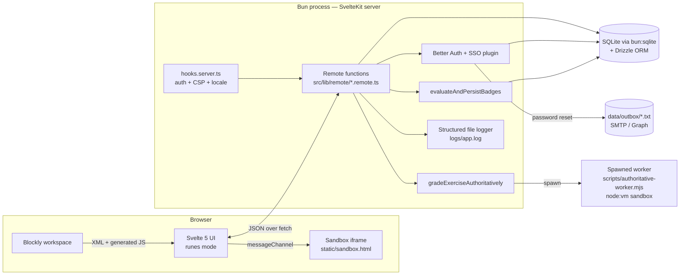
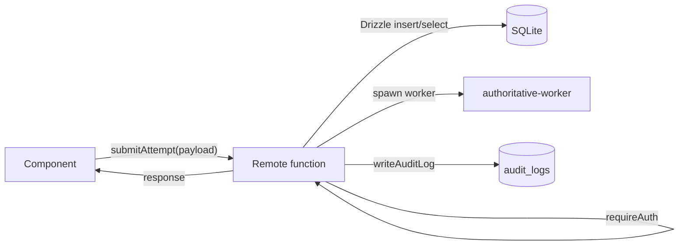

# Architecture

BlockQuiz is a single SvelteKit application that runs on Bun, ships in one
Docker image, and persists state in SQLite. Everything — learner UI, teacher
CMS, authentication, grading worker, audit log — lives in the same process.
This document explains why that shape was chosen, how the pieces compose, and
what to expect on a request path.

## High-level shape



The colors of this drawing matter:

- **Browser-side execution** lives in an iframe loaded from
  `static/sandbox.html`. It is *not* a SvelteKit route; the parent page talks
  to it over a `MessageChannel`. That keeps user code separate from the
  Svelte app even though both are downloaded from the same origin (more on
  why in `sandbox-and-grading.md`).
- **Server-side execution** for *grading* uses a freshly spawned Bun
  subprocess that runs the same instrumented code inside `node:vm`. The
  parent server never `eval`s student code in-process.
- **Persistence** is one SQLite file. Better Auth, app settings, content,
  attempts, audit logs, and translations all coexist in the same database,
  which is appropriate for the single-school / thesis-demo scale targeted by
  the MVP.

## Stack at a glance

| Layer | Choice | Why this one |
| --- | --- | --- |
| Runtime | Bun ≥ 1.0 | `bun:sqlite` (zero-dep SQLite), fast cold start, `Bun.password.hash/verify` lets `better-auth` use Argon2id without extra packages, single binary keeps Docker image small. |
| Web framework | SvelteKit + Svelte 5 (runes) | Runes give us `$state`/`$derived` for the heavy reactive UIs (Blockly + Canvas + replays) without an external store library; SvelteKit *remote functions* (`form/command/query`) replace REST endpoints and let the same TS types be shared between client and server. |
| Block editor | Blockly | De facto standard for block-based education tools; we use the JavaScript generator and ship the media files via `scripts/copy-blockly-media.ts`. |
| Auth | Better Auth + `@better-auth/sso` | Email/password + OIDC + SAML in a single API surface; uses our `drizzleAdapter` for storage. Just-in-time role mapping is wired in `src/lib/server/auth.ts:54`. |
| ORM | Drizzle | Lightweight schema-as-code, ergonomic typed queries, plays well with `bun:sqlite`. |
| Validation | Zod | Used everywhere remote-functions take user input (`form`, `command`, `query`) and to gate inter-process worker output. |
| Styling | Tailwind + `@tailwindcss/typography` | Tailwind for the app shell + custom CSS variables for theming via `[data-theme="dark"]`. |
| i18n | Custom runes-based store (`src/lib/i18n/index.svelte.ts`) | Avoids the SSR/CSR mismatches we hit with the larger off-the-shelf i18n libraries; pairs with a server-side locale helper for the initial `<html lang>`. |
| Testing | Vitest (unit) + Playwright (focused e2e) + smoke scripts | Smoke scripts boot the production build and exercise the boot path; useful for catching schema-init regressions in CI. |

## Repo layout

```
src/
  app.html                       inline boot script (theme + lang interp)
  hooks.server.ts                request-level auth gate, CSP, locale resolve
  routes/
    (auth)/login/                public sign-in + reset-password flow
    (app)/                       authenticated app — courses, cms, settings, users, logs
    demo/                        public guest play (localStorage progress)
    privacy/                     standalone privacy page
  lib/
    achievements/                pure badge rules (SDT-themed)
    analytics/                   course analytics + pseudonymous research export
    attempts/                    invariants + submission-shape validators
    blockly/                     BlocklyFactory, block presets, code readout
    canvas/                      Canvas2D / Turtle / Robot engines, grid, collision, pathfinding
    components/                  Svelte components (CMS, player, editor, shared)
    courses/                     publish-readiness validator for courses
    graders/                     IO + visual graders (pure, runs in browser AND server)
    guest-progress/              localStorage-backed guest store + merge logic
    i18n/                        runes i18n store + DE/EN dictionaries
    import-export/               course/exercise transfer schemas
    logs/                        file/JSON logger
    player/                      executor + toolbox builder
    remote/                      `.remote.ts` SvelteKit remote functions
    sandbox/                     SandboxExecutor + worker types/runtime helpers
    server/                      everything Bun-only: auth, db, audit, settings, email, badges, authoritative-execution
    toaster/                     shared toast system
    types/                       domain types — Exercise, Course, Attempt
    utils/                       requireAuth, sanitize, small helpers
scripts/
  authoritative-worker.mjs       child process used by server-side grading
  db-push.ts                     schema initializer (canonical setup path)
  copy-blockly-media.ts          ensures Blockly media files end up in static/
  smoke.ts / docker-smoke.ts     production boot smoke tests
  verify-db.ts                   idempotency + actor-constraint check
  setup-e2e.ts                   Playwright fixture bootstrap
static/
  sandbox.html                   the *only* page rendered with sandboxed iframe semantics
  blockly-media/                 copied at install time
drizzle/                         historical migrations (see docs/database.md)
data/                            dev.db / prod.db, plus data/outbox/ for the file email driver
logs/                            app.log and error.log (newline-delimited JSON)
```

## Request lifecycle

```mermaid
sequenceDiagram
  participant Browser
  participant Hook as hooks.server.ts
  participant Auth as Better Auth
  participant Route as +page.svelte / remote fn
  participant DB as SQLite

  Browser->>Hook: GET / or POST .remote.ts call
  Hook->>Auth: auth.api.getSession(headers)
  Auth->>DB: select session/user
  Auth-->>Hook: session?
  alt Inactive user
    Hook->>Hook: drop session; treat as unauth
  end
  alt Not authed & route not public
    Hook-->>Browser: 303 → /login
  else Authed & visiting /login
    Hook-->>Browser: 303 → /
  else
    Hook->>Route: resolve(event)
    Route->>DB: queries (via Drizzle) or auth.api.*
    Route-->>Hook: response
    Hook->>Hook: set CSP + other headers, transform `<html lang>` via getRequestLocale
    Hook-->>Browser: response
  end
```

Specifics worth knowing:

- `hooks.server.ts:44` runs *before* every request and is the only place where
  the redirect-vs-allow decision happens. The list of public prefixes lives
  in one constant in `src/lib/server/access-policy.ts:1` so it can be unit
  tested separately from the hook.
- Locale is resolved *server-side* from the `i18n-locale` cookie or the
  `Accept-Language` header (`src/lib/server/locale.ts:23`), then injected
  into `%lang%` in `src/app.html:2` via `transformPageChunk`. This avoids a
  flash of the wrong language on the first render.
- The `withDocumentLocale` wrapper in `hooks.server.ts:30` is composed with
  the `svelteKitHandler` from Better Auth so that the auth plugin's mounted
  routes (`/api/auth/*`) still see the same locale-aware response.

## Remote functions instead of REST

Almost every server-side action is exposed as a SvelteKit *remote function*
(`form`, `command`, `query`) under `src/lib/remote/*.remote.ts`. Three
properties drive that choice:

- The client imports the function directly (`import { submitAttempt } from
  '$lib/remote/courses.remote'`); types are end-to-end safe with no codegen.
- Each export validates its input with Zod *inline*, so the schema is the
  contract.
- `requireAuth` / `requireTeacherOrAdmin` (`src/lib/utils/requireAuth.ts`) sit
  at the top of mutating remotes; failing to call them is an obvious code
  review smell rather than a missing piece of middleware.



## Process topology

There is one long-running Bun process serving SvelteKit, plus on-demand
short-lived workers for grading:

- **Main process (Bun)**: serves HTTP, holds the SQLite connection, runs
  the auth, audit log writer, badge evaluator, file logger. It does *not*
  run learner-submitted code in-process — see
  `src/lib/server/authoritative-execution.ts:160`.
- **Per-submission worker (`bun scripts/authoritative-worker.mjs`)**: spawned
  with `child_process.spawn`, fed JSON over stdin, returns JSON over stdout
  with a 1 MiB ceiling, killed with `SIGKILL` past the wall clock. Uses
  Node's `vm.Script` with a hand-built context where dangerous globals
  resolve to throwing stubs.

Email delivery is in-process but pluggable: `file` driver writes to
`data/outbox/`, `smtp` uses Nodemailer, `graph` uses Microsoft Graph
`sendMail`. The dispatcher falls back to `file` if a configured driver
throws, so reset links survive misconfiguration
(`src/lib/server/email/index.ts:16`).

## Deployment topology

Two compose files:

- `docker-compose.dev.yml` — bind mounts the working tree and runs the dev
  server with `bun --bun run dev`. Database init runs on container startup.
- `docker-compose.prod.yml` — multi-stage image; the final stage runs the
  Bun adapter (Node-style HTTP server) on `PORT`. Production *requires*
  `BETTER_AUTH_URL` and `AUTH_SECRET`; the auth module throws on boot if
  either is missing (`src/lib/server/auth.ts:19`).

The intentional invariant is "one process, one DB file, one Docker image".
Every cross-cutting concern (auth, audit, badges, grading) is just a function
call. This is appropriate for the single-school / classroom-of-30 deployment
target; scaling to many schools would mean swapping SQLite for a server
database and moving the grading worker into a sandboxed container — both
called out as future work in the README.

## Cross-references

- For *content* model (`Exercise`, `Course`, validation cycle) → see
  [exercises-and-content.md](./exercises-and-content.md).
- For the *grading pipeline* in detail → see
  [sandbox-and-grading.md](./sandbox-and-grading.md).
- For *progress and analytics* derived from attempts → see
  [progress-attempts-analytics.md](./progress-attempts-analytics.md).
- For *security headers, audit logging, role checks* → see
  [auth-and-security.md](./auth-and-security.md).
