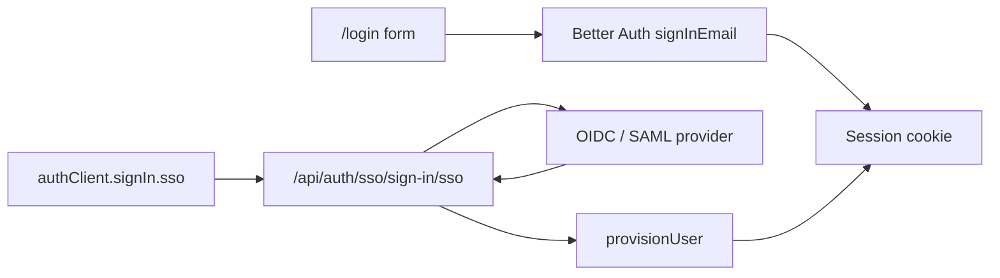
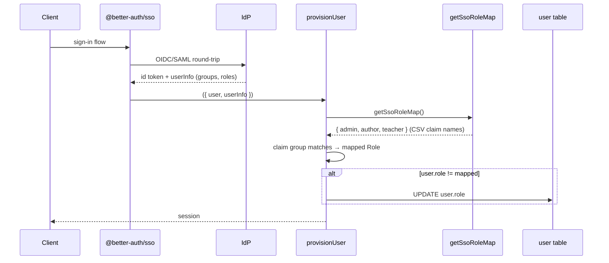

# Auth, Roles & Security

BlockQuiz authenticates with [Better Auth](https://better-auth.com),
configured for email-and-password plus the `@better-auth/sso` plugin.
Authorization is enforced in two places — a request-level gate in
`hooks.server.ts` for redirects, and per-function `requireAuth` /
`requireTeacherOrAdmin` calls in every mutating remote. This document
describes the full chain, including the cross-cutting concerns
(CSP, headers, audit log) that surround it.

## Identities and roles

```ts
enum Role {
  STUDENT = 'student',
  TEACHER = 'teacher',
  AUTHOR  = 'author',
  ADMIN   = 'admin'
}
```

- **STUDENT** — default for any authenticated user. Sees `/courses`,
  `/settings`, can submit attempts, cannot author.
- **TEACHER** — manages course content, sees `/cms` and per-course
  analytics.
- **AUTHOR** — same content surface as teacher but typically used to
  separate "content team" vs. "school faculty" in larger deployments. In
  the current MVP it shares the teacher-or-admin gate.
- **ADMIN** — everything above plus `/users` and `/logs`, plus settings
  pages for email/SSO/role map.

A separate `user.active: boolean` column gates accounts that have been
deactivated. Inactive users are *not* treated as students; they're
treated as logged-out (see hook below).

## Sign-in surfaces

Two ways to authenticate:



### Email + password

`login` remote form (`src/lib/remote/auth.remote.ts:19`) calls
`auth.api.signInEmail`. On success it issues a 303 to `/courses`. On
failure (or if the user is marked `active: false`) it calls `invalid()`
with a generic error message so an attacker can't probe the account
existence. `register` is intentionally disabled — public sign-up is not
supported; admins create users.

Passwords are hashed with `Bun.password.hash` (default Argon2id) and
verified with `Bun.password.verify`. Hash storage is in
`account.password` (Better Auth's table).

### SSO

`@better-auth/sso` provides OIDC and SAML provider records in the
`ssoProvider` table. The client uses
`authClient.signIn.sso({ email })` to look up the provider by email
domain, or `{ providerId }` to skip the lookup.

On every successful SSO sign-in, `provisionUser`
(`src/lib/server/auth.ts:84`) maps the IdP's `groups`/`roles` claim to a
BlockQuiz role:



`provisionUserOnEveryLogin: true` means group changes in the IdP take
effect on the *next* sign-in, not via SCIM. The role-map values are
maintained in `app_settings` under the key `'sso.roleMap'` and editable in
**Settings → Single sign-on**; environment variables
(`SSO_ROLE_MAP_ADMIN`, `_AUTHOR`, `_TEACHER`) override the stored values
and the UI shows an "env override" badge so admins know the form is
read-only — see [sso-and-email.md](./sso-and-email.md).

A user with no matching group falls through to `STUDENT`. This is the
correct default: an over-eager IdP integration cannot accidentally
elevate someone to admin.

## Request-level gate

`hooks.server.ts:44` is the only place that decides "should this request
even reach the page". The decision tree:

```mermaid
flowchart TD
  start([request]) --> session{auth.api.getSession}
  session -->|present & active| setLocals[locals.user = user]
  session -->|inactive user| drop[ignore session]
  setLocals --> login{visiting /login?}
  drop --> public{is path public?}
  login -->|yes| redirHome["303 → /"]
  login -->|no| public
  public -->|no & not authed| redirLogin["303 → /login"]
  public -->|yes or authed| handler[resolve(event)]
  handler --> hardens[apply security headers + locale]
  hardens --> done([response])
```

The list of "public" route prefixes lives in
`src/lib/server/access-policy.ts:1`:

```ts
['/login', '/demo', '/privacy', '/api/auth', '/reset-password']
```

It is a small, exported, unit-tested array. Adding a public page is a
single-line patch and shows up in code review immediately.

## Function-level gate

Every mutating remote starts with one of two calls
(`src/lib/utils/requireAuth.ts`):

- `requireAuth(role?)` — must be logged in (and active); optional exact
  role match.
- `requireTeacherOrAdmin()` — must be one of `TEACHER`, `AUTHOR`, `ADMIN`.

`requireAuth` issues a 308 redirect to `/login` on failure, which is what
SvelteKit's RPC mechanism turns into a navigation on the client.
`requireTeacherOrAdmin` issues a 403 if the user is logged in but lacks the
role.

Why two gates? Because the layouts and `+page.server.ts` files can also
check roles for redirecting users *away* from admin pages, but the
**authoritative** check is at the function level. A future refactor that
loses a layout-level redirect cannot accidentally expose a write path —
the function will still throw.

For *queries* that should be teacher-or-admin (analytics, audit logs),
`requireAuth(Role.ADMIN)` or `requireTeacherOrAdmin()` is also the first
call. `getCurrentUser` is intentionally open (just returns
`locals.user`), used by the layout to render the user chip.

## Security headers

`hooks.server.ts:8` attaches a fixed header set to every response:

| Header | Value | Why |
| --- | --- | --- |
| `Content-Security-Policy` | `default-src 'self'; script-src 'self' 'unsafe-inline'; style-src 'self' 'unsafe-inline'; img-src 'self' data: blob: https:; font-src 'self' data:; connect-src 'self'; frame-src 'self'; child-src 'self'; object-src 'none'; base-uri 'self'; form-action 'self'; frame-ancestors 'self'` | Tight default; the `unsafe-inline` for scripts is needed for the theme bootstrap in `app.html`, the one for styles for Svelte's runtime style injection. |
| `Cross-Origin-Opener-Policy` | `same-origin` | Isolates the browsing context so the sandbox iframe cannot reach into popups. |
| `Cross-Origin-Resource-Policy` | `same-origin` | Defeats cross-origin reads of our static assets. |
| `Referrer-Policy` | `strict-origin-when-cross-origin` | Don't leak full URLs cross-origin. |
| `X-Content-Type-Options` | `nosniff` | Don't let the browser MIME-guess into a script. |
| `X-Frame-Options` | `SAMEORIGIN` | Reinforces `frame-ancestors`. |

Note that the *sandbox iframe* itself is loaded with `sandbox="allow-scripts"`
and *without* `allow-same-origin`, which gives it a `null` origin. The CSP
allows `frame-src 'self'` so the iframe loads, and our message-channel
filtering checks `event.origin === 'null'` before trusting the iframe's
ready signal (see [sandbox-and-grading.md](./sandbox-and-grading.md)).

## Audit log

```mermaid
flowchart LR
  Action[Mutating remote / settings save] --> Write[writeAuditLog]
  Write --> Insert[(audit_logs table)]
  Insert --> View[/logs admin page]
  ErrFile[(logs/app.log)] --> View
```

`src/lib/server/audit.ts` exposes a single `writeAuditLog({ actorUserId,
action, details })` that inserts into the `audit_logs` table. It catches
its own errors and only logs a warning if the insert fails — the policy is
"never block a request because the audit insert hit an error".

Examples of actions captured:

- `'password.reset_requested'`, `'password.reset_completed'` (no user id is
  recorded on the request — only the email — to avoid timing-based
  enumeration; the *completed* log includes the user id).
- `'guest.import'` with counts.
- Settings changes (`'settings.email.update'`, `'settings.sso.roleMap.update'`,
  …).
- Per-CMS actions (publish/clone/archive/restore in
  `exercises.remote.ts` and `courses.remote.ts`).

The `/logs` admin page reads both `audit_logs` and the JSON-line file log
(`logs/app.log`), merges them by timestamp, applies the requested level
filter, runs a Fuse.js fuzzy search on the merged set, and paginates. See
`src/lib/remote/logs.remote.ts:85`.

## Structured logging

`src/lib/logs/logger.ts` is a tiny JSON logger that writes one line per
event to `logs/app.log` (and *also* to `logs/error.log` for errors). Each
line is a single JSON object with `timestamp`, `level`, `message`,
`service: 'blockquiz-app'`, the inferred caller function name (from
`new Error().stack` so we never miss it), and any user-supplied `meta`.

This shape is deliberately greppable and JQ-friendly, so an admin
investigating an incident can pipe the file through standard tools. In
non-production the same line is `console.log`'d for live debugging.

## Email & secrets

Password resets and (future) admin notifications go through
`src/lib/server/email/`. The driver layer (`file | smtp | graph`) is
configurable in **Settings → Outbound email**; environment variables
override stored values and the UI shows the override.

If the configured driver throws at send time, the dispatcher falls back to
the `file` driver so the reset link is written to `data/outbox/*.txt`
instead of being lost (`src/lib/server/email/index.ts:36`). This is a
deliberate "fail open in a useful direction" policy: a deployment with a
broken SMTP config still produces working reset links, just visible in the
admin's file system.

Secrets (SMTP passwords, Graph client secrets) live in `app_settings.value`
as JSON. They are not encrypted at rest because SQLite-level encryption
would require sqlcipher; instead, file system permissions on `prod.db`
are the protection boundary. For deployments where this is insufficient,
the env-var override path lets the secrets stay out of the database
entirely.

## Production bootstrapping requirements

`src/lib/server/auth.ts:19` throws on startup in production if either
`BETTER_AUTH_URL` or `AUTH_SECRET` is missing. The `building` flag from
`$app/environment` is checked first so the bundler can still complete a
build without these set. The smoke test (`scripts/smoke.ts`) and the
Docker compose files enforce them in the *runtime* environment.

## Threat model recap

The system is designed against a *moderately motivated* threat model
appropriate for a thesis MVP:

| Threat | Mitigation |
| --- | --- |
| Learner forges a passing grade via devtools | Server re-grades every submission; client-supplied `passed`/`score` are discarded. |
| Learner reads hidden test answers | Hidden tests stripped from learner payload (`stripExerciseForLearners`); grader omits `expected`/`actual` for hidden tests. |
| Learner runs malicious JS inside the sandbox | Iframe is `null`-origin with `sandbox="allow-scripts"`; blocked-globals stubs; loop-trap and timeout traps; server uses an OS-level child process for re-grading. |
| Learner DoSes the server with infinite loops | `child_process.spawn` with `SIGKILL` past `timeout + 2 s`; per-process 1 MiB stdout cap; Zod-validated worker output. |
| Cross-site script injection into the app shell | CSP `default-src 'self'`; `script-src 'self' 'unsafe-inline'` is only for the one bootstrap line we control; sanitize HTML for user-supplied content (`src/lib/utils/sanitize.ts`). |
| Account enumeration via login error | `login` returns a generic "Invalid email or password" for both bad password and inactive account. |
| Public registration abuse | `register` remote is disabled and returns a generic message; admins create users. |
| Stolen session token replay | Session rows in SQLite are tied to user agent and IP and have expiration; logout deletes the row server-side. |
| Imported research data re-identifying learners | Pseudonyms are SHA-256 with a course-scoped salt; no raw ids escape (`research-export.ts`). |

What is *not* mitigated and explicitly left to a future iteration:

- Sandbox escape from sufficiently adversarial JS (web workers, generator
  abuse). Out of scope for child-friendly classrooms.
- Multi-tenant isolation across schools — there is no concept of
  "organization" in the schema. Each deployment is one school.
- Network-level rate limiting. The Bun adapter does not rate-limit; this
  is delegated to whatever reverse proxy is in front (recommended:
  `traefik` or `caddy` with a per-IP rule).

## Cross-references

- The full SSO/email setup walkthrough → [sso-and-email.md](./sso-and-email.md).
- The list of public/authenticated/role-protected routes →
  [access-policy.md](./access-policy.md).
- The grading authority guarantee → [sandbox-and-grading.md](./sandbox-and-grading.md).
