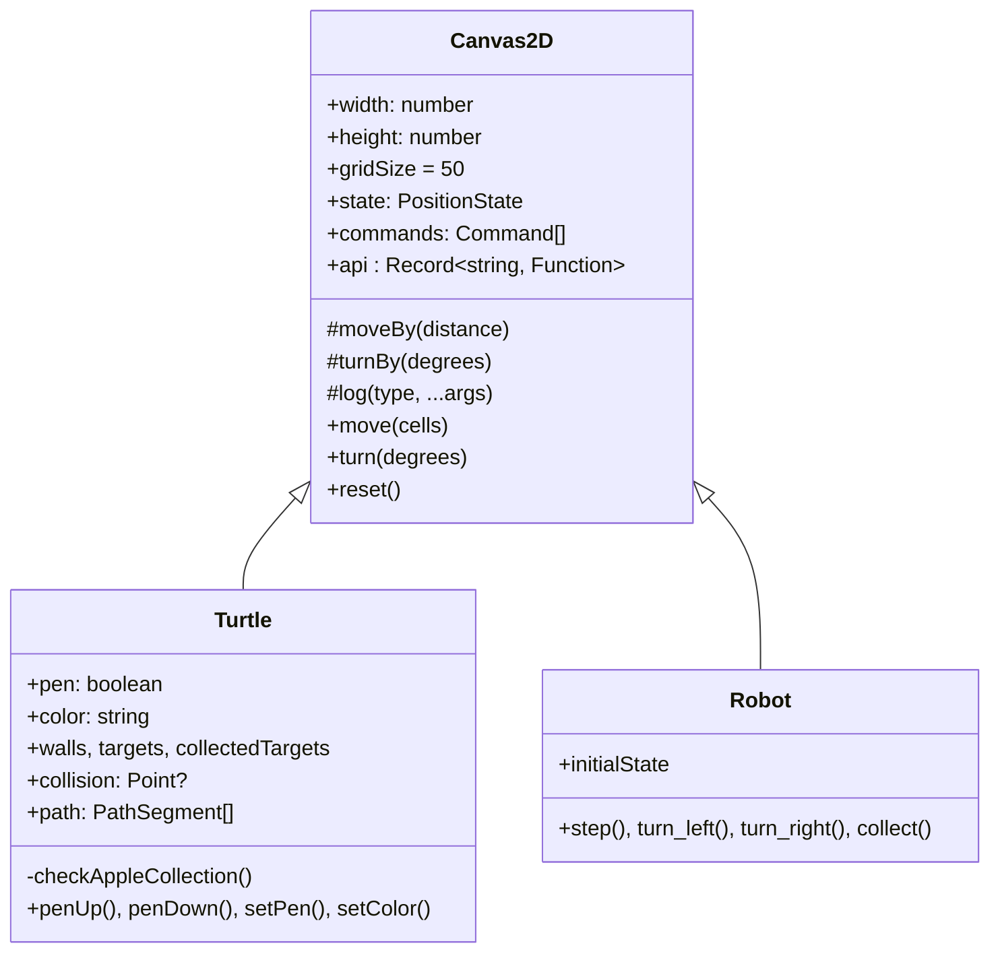
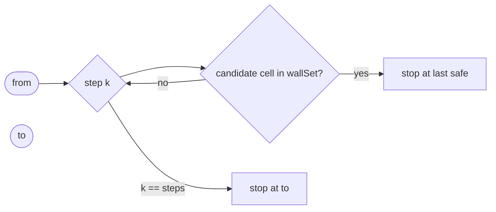
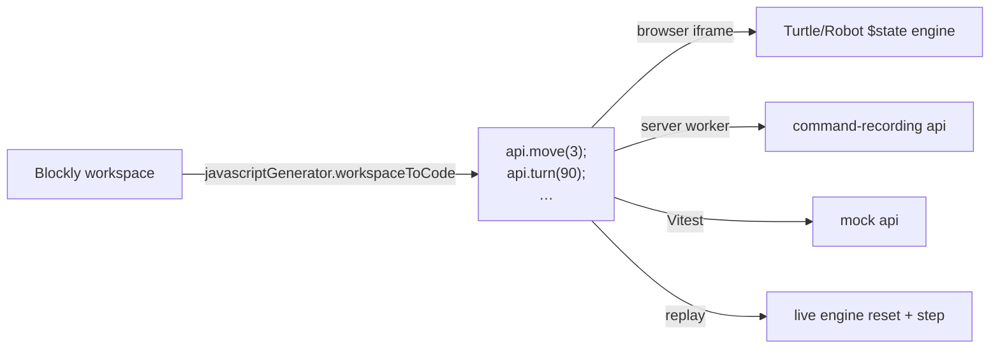

# Canvas Engines (Turtle, Robot) & Blockly Integration

Two visual exercise types — Turtle and Robot — share a single
`Canvas2D` base engine and a single block registration pipeline. This page
explains the shared abstraction, the per-engine specializations, the
collision + pathfinding helpers, and how Blockly definitions become live
JavaScript that the sandbox can execute.

## Engine class hierarchy



Why a class hierarchy when most of the codebase prefers composition? Two
reasons:

- The engine's *reactive state* is a Svelte 5 rune (`$state<…>(...)`). To
  use runes outside of a `.svelte` file, the file must end in
  `.svelte.ts` and the runes must be declared as fields on a class (or
  module-level `let`). A class lets Turtle/Robot inherit one rune-based
  state shape (`PositionState`) instead of redeclaring the same `$state`
  initializer in every subclass.
- The base class fixes the *command log* protocol that the sandbox depends
  on. Both Turtle and Robot must emit `move`, `turn`, etc. in the same
  shape so the graders and the replay step-through work over a single
  command stream.

## What lives in state

`state` is `{ x, y, angle }` in pixel coordinates (radians-of-degrees, top
clockwise). `commands` is the time-ordered command log. The log entries are
`{ type, args: string[], timestamp }` — args are stringified deliberately so
the on-the-wire shape coming from the sandbox iframe is identical.

`gridSize` is a property because it differs per exercise (50 px is the
default but the editor lets authors change it). `move(cells)` multiplies by
`gridSize` to get pixel distance, so authors and learners think in *cells*
while the canvas math runs in pixels.

For Turtle, additional reactive fields hold the pen state, color, the
drawn `_path`, the wall and target arrays, the collected-target indices,
and the collision point. `collectedTargets` is an array (not a Set)
because Svelte's deep reactivity tracks array mutations cleanly.

## Movement and the pen

`Canvas2D.moveBy` computes new x/y using sine/cosine of `angle`. The trick
worth noticing: y *decreases* as the turtle moves "up" (negative direction
of canvas Y). Combined with `angle = 0` meaning "north", the math becomes:

```ts
x += distance * sin(angle);
y -= distance * cos(angle);
```

This convention is mirrored in the grader's `simulateTurtle` /
`simulateRobot` functions so the server's re-simulation and the browser's
live state agree byte-for-byte on identical command streams.

The Turtle override of `move` (`Turtle.svelte.ts:74`) is where the
interesting per-frame logic lives:

1. If already collided, no-op.
2. Compute the desired endpoint.
3. Call `traceCollision` — if it hits a wall, snap to the last safe
   sub-step and record `collision` plus a `'collision'` command in the log
   for the trace.
4. If the pen is down, append a `PathSegment` from `from` → final to
   `_path` for the visual overlay.
5. Check apple-collection (`checkAppleCollection`).

## Collision detection



`traceCollision` (`src/lib/canvas/collision.ts:24`) is the
*supercover-lite* approach:

- Build a `Set<string>` of occupied cells from the wall list.
- Walk the segment in sub-steps of `gridSize / 4` pixels (`stepLength`).
- At each step, compute which cell the candidate point is in; if that cell
  is occupied, stop at the *previous* safe point and report the hit cell
  (`cellCol`, `cellRow`).

`gridSize / 4` is deliberately small enough that the longest in-pixel
movement (a full canvas crossing at the smallest sensible grid size) still
yields fewer than ~30 iterations. The trade-off is correctness vs. cost: a
finer step would catch theoretical edge cases (a wall on a near-tangent
diagonal) at the price of more work; this resolution is enough for the
classroom exercises we ship.

`grid.ts` exposes the helpers the collision code needs:
`cellOf(point, gridSize)`, `cellKey(cell)` (stable `"col,row"` strings for
`Set`/`Map`), `pointsToCellSet`, `dedupePointsByCell` (used by the editor
so two clicks in the same cell don't stack walls).

## Pathfinding (publish-time reachability)

`checkReachability` (`src/lib/canvas/pathfinding.ts:35`) is BFS over the same
discretized grid. It returns `{ ok: true }` or
`{ ok: false, reason: '…' }`. The reasons map 1:1 to the issue codes the
publish validator emits, so the UI can show a localized message for each.

This is called from two places:

- `validateExercise` (`exercise.ts:850`) — at publish time, to refuse
  exercises whose start cell cannot reach the finish cell.
- The CMS exercise editor's "is this still solvable?" live indicator (via
  `canvas-sync.ts`) — same function, different surface.

Because the function is pure and synchronous, both can call it on every
keystroke without coordination.

## Block definitions and dynamic API

Each engine declares an array of `BlockDef`s. The Turtle adds `pen` and
`color` blocks (`Turtle.svelte.ts:34`); the Robot defines its own movement
block set (`step`, `turn_left`, `turn_right`, `collect`) instead of using
the base's parametric `move(N)` and `turn(deg)` — see
`Robot.svelte.ts:25`.

`initBlocks(blocks, prefix)` in
`src/lib/blockly/BlocklyFactory.ts:11` does three things per definition:

1. Registers a Blockly `Block` whose `init` function builds the input
   shape from `block.args` (number/string/color → value input with
   typed checks; dropdown → field with options; no args → dummy input
   with the label).
2. Registers a JavaScript generator for the prefixed id
   (`${prefix}_${id}`). The generator always emits one line:
   `api.${method}(...args);`.
3. Sets statement connectors on both sides (`setPreviousStatement(true)` +
   `setNextStatement(true)`) so the blocks chain like statements, not
   expressions.

This pattern is what makes the sandbox boundary work: a Blockly
`api.move(3)` block always emits literal `api.move(3);`, and that text runs
in *every* execution context (browser iframe, server worker, Vitest unit
test, replay simulator) by binding `api` to whichever environment is
appropriate.



The toolbox builder (`src/lib/player/toolbox.ts`) reads the exercise's
`config.toolbox` whitelist and only includes the engine blocks that appear
in that list. This is how authors restrict an exercise to specific
operations (e.g. "you may use `move` and `controls_repeat_ext` but not
`turn`").

## Code readout

Beside the Blockly workspace there is a plain-language "what does my
program do?" panel rendered by `CodeReadout.svelte`. The heavy lifting is
in `src/lib/blockly/codeReadout.ts`:

- Parses the workspace XML with a hand-written parser narrow enough to
  understand only the elements Blockly actually emits
  (`block`, `shadow`, `field`, `value`, `statement`, `next`).
- Walks the parsed AST and emits one bullet line per block, indented for
  nested statements (loops, ifs).
- Has DE + EN translation tables keyed by block type, plus parametric
  forms (`moveCells(n)`, `turnDegrees(n)`, etc.).

Why hand-written XML parsing instead of `DOMParser`? Three reasons:

- It runs identically on the server (e.g. for a future "describe this
  workspace" admin tool) and in the browser without taking a DOMParser
  polyfill or shimming `XMLDocument`.
- It is intentionally robust against the XML subset Blockly emits and
  treats everything else as opaque, instead of choking on namespaced
  attributes Blockly *sometimes* adds.
- It builds *new* regex instances per call so `lastIndex` cannot leak
  between recursive invocations — a real footgun with shared `RegExp`s.

The pedagogical motivation (cited inline in the file header) is the
"blocks → natural language" bridge from Weintrop & Wilensky 2015: kids
should be able to read what their program does in their first language
before they have to read JavaScript.

## Canvas component

`src/lib/components/Canvas.svelte` is the visual renderer. It draws (in
this z-order):

1. The grid lines (using `gridSize`).
2. Walls (faded fill on the wall cells).
3. The pen path (`engine.path` for Turtle, last-segment for Robot).
4. Targets / collectibles.
5. The actor sprite at `state.x`, `state.y`, rotated by `state.angle`.
6. A collision marker when `engine.collision != null`.

It is fully reactive — any rune update on the engine is reflected on the
next animation frame. The "Replay" panel uses
`ExecutionState.seekToCommand` (see
[sandbox-and-grading.md](./sandbox-and-grading.md#replay)) to advance the
engine one command at a time so the canvas renders the intermediate state.

## Per-engine quirks

- **Turtle palette rotation** — collecting an apple cycles the pen color
  through a six-color palette (`APPLE_PALETTE` in `Turtle.svelte.ts:10`).
  This is a small piece of intrinsic motivation: kids get visible feedback
  for goal achievement without the grader being involved.
- **Robot ignores arbitrary degrees** — only `turn_left`/`turn_right`
  blocks are exposed (90° increments). The base `turn(deg)` is still there
  in the engine API for forward compatibility, but the toolbox can't
  surface it because the Robot's `blockDefs` overrides the base.
- **Pen is "draw / don't draw"** — the dropdown labels are explicitly
  kid-friendly ("draw" / "don't draw") rather than technical ("up" /
  "down"). The internal value is still `'up'/'down'` and that's what gets
  serialized into the workspace XML, so the change is purely surface UX
  (`Turtle.svelte.ts:39`).
- **Reset semantics** — Turtle resets to the *canvas centre* by default
  (`Canvas2D.reset()`), but the Turtle player overrides the engine's
  `state.x/y` to the exercise's configured `canvas.start` (see
  `ExecutionState.initialize`). The base reset is fine for the test page;
  the player wires up the real exercise start position.
- **Sub-step quantum is per gridSize, not absolute** — `gridSize / 4` for
  collisions, `gridSize / 4` for the path tolerance default. Authors can
  change `gridSize` per exercise and these heuristics scale with it
  instead of needing manual retuning.
