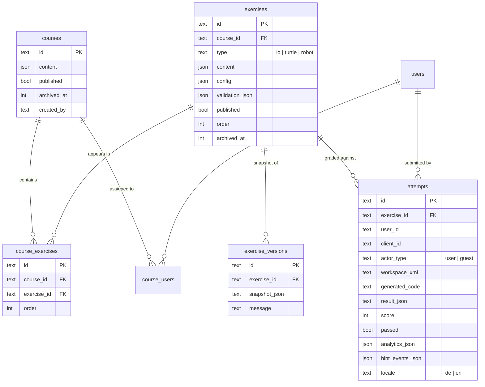
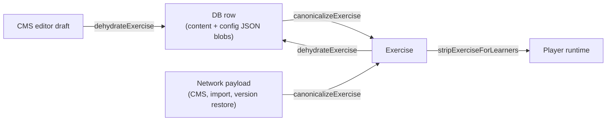
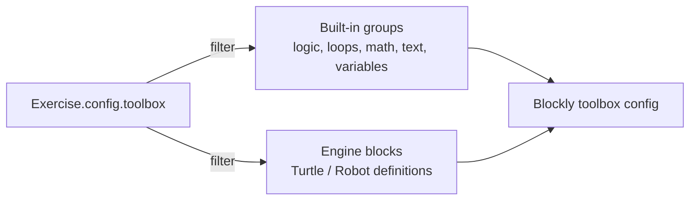

# Exercises & Content Model

BlockQuiz revolves around three kinds of *exercise* — IO, Turtle, and Robot
— grouped into *courses*. Each exercise carries content (localized title and
description, optional worked example, image), authoring config (toolbox,
starter XML, hints), engine-specific config (canvas / grid / IO settings),
and one or more *test cases* used by the grader. This document describes
how that domain is modeled in TypeScript, how it round-trips through the
database, and the small handful of invariants that the rest of the app
depends on.

## Tables in scope



There is no foreign key between `attempts.user_id` and `users.id` for guest
attempts on purpose — see [Attempt actor invariant](#attempt-actor-invariant).

## The `Exercise` discriminated union

`Exercise` is a discriminated union (`type: 'io' | 'turtle' | 'robot'`)
defined in `src/lib/types/exercise.ts:232`. The shared base is
`ExerciseBase` (id, courseId, content, toolbox, starter XML, hints,
publish/order flags, validation, audit timestamps).

```ts
type Exercise = IoExercise | TurtleExercise | RobotExercise;

interface IoExercise extends ExerciseBase {
  type: 'io';
  io: IoExerciseConfig;            // tests, normalization, sample I/O
  config: ExerciseCompatConfig;    // see below
}
interface TurtleExercise extends ExerciseBase {
  type: 'turtle';
  canvas: TurtleCanvasConfig;      // width/height/gridSize + walls/targets
  grader: TurtleGraderConfig;      // testCases + tolerances
  config: ExerciseCompatConfig;
}
interface RobotExercise extends ExerciseBase {
  type: 'robot';
  grid: RobotGridConfig;           // grid size, start, direction, walls
  grader: RobotGraderConfig;
  config: ExerciseCompatConfig;
}
```

Two redundant fields exist for a reason:

- `io` / `canvas` / `grid` / `grader` are the *typed* config, branch-narrowed
  by the discriminator.
- `config: ExerciseCompatConfig` is a single *flat* shape that always
  contains all three engines' configs, even for IO exercises. It exists
  because (a) the database row holds one JSON blob, (b) the CMS editor
  builds a working copy that gets temporarily inconsistent while the author
  flips between exercise types, and (c) several import paths used to
  consume the flat shape historically. `canonicalizeExercise` keeps both
  views in sync so consumers can pick whichever ergonomics suits them.

The hints model (`ExerciseHint`) has `id`, localized text, a `trigger`
(`'click' | 'time'`), and an optional `delaySeconds`. The trigger drives the
player's hint UI — click hints have a button; time hints reveal themselves
after the configured delay. Hint usage is recorded in `hint_events_json`
which is later consumed by the analytics pipeline.

The optional `workedExample` (description + starter XML + explanation,
each localized) is intended for worked-example pedagogy: the learner sees a
small solved task before attempting the real exercise. The DB field
`example` is the deprecated legacy alias and is normalized into
`workedExample` on read.

## Canonicalize / dehydrate cycle

Every time an exercise crosses the boundary between database, network, and
editor, it goes through one of two pure functions:



- `canonicalizeExercise` (`exercise.ts:1017`) accepts a lossy
  `ExerciseInput` shape and normalizes it into a strict `Exercise`. It
  defaults missing fields, coerces numbers/strings/booleans, drops unknown
  test-case types, and decides which of `io | canvas | grid` is the
  authoritative engine config.
- `dehydrateExercise` (`exercise.ts:1129`) is the inverse — it returns the
  exercise itself plus *the* JSON blobs (`content`, `config`,
  `validation`) that the SQLite columns expect. The CMS uses it on save.
- `stripExerciseForLearners` (`exercise.ts:1151`) drops *hidden* test cases
  before the exercise is sent to the player. This is the second line of
  defense against learners snooping hidden tests: the grader also redacts
  `expected` / `actual` for hidden tests, but the strip step means the data
  never reaches the browser in the first place.

These three functions are pure and synchronous. Anywhere a `db.select()…`
returns an exercise row, the call site is responsible for piping it through
`canonicalizeExercise` — see `hydrateExerciseRow` in
`src/lib/remote/exercises.remote.ts:72`.

## Publish validation

`validateExercise` (`exercise.ts:850`) returns a structured
`PublishValidationResult` listing issues. Each issue has a stable `code`,
field path, message, and severity (`error | warning`); only `error`-severity
issues block publishing.

What it checks today:

- Localized title and description are present in both DE and EN.
- `toolbox` contains no empty ids and no unknown block ids
  (`ALLOWED_TOOLBOX_BLOCKS`).
- `starterXml` is empty *or* a parseable Blockly XML document whose block
  types are all in `ALLOWED_TOOLBOX_BLOCKS` *and* in the exercise's
  `toolbox`. This means a starter block cannot quietly require a block the
  learner doesn't have.
- At least one test case exists, and at least one of them is hidden. This
  is the autograder's "no free pass" rule: every exercise must be checked
  by something the learner can't see.
- Type-specific geometry: positive canvas/grid dimensions for visual
  exercises, `stdin-stdout` mode for IO.
- For turtle exercises, `checkReachability` (BFS over the wall grid) verifies
  that the configured `start` cell can reach the `finish` cell. If not,
  the issue's code carries the BFS-side reason
  (`no-start | no-finish | start-on-wall | finish-on-wall | unreachable`)
  and the UI shows the matching authored hint message.

The validation result is *stored* in `exercises.validation_json` so a stale
exercise can still be displayed in the CMS list with its last-known issues.
`canonicalizeExercise` will re-run validation if no stored validation is
present, but won't otherwise — so we avoid surprise validation churn on read.

## Course publish validation

`validateCoursePublishReadiness` (`src/lib/courses/validation.ts:47`) layers
extra rules on top of the per-exercise validation:

- Course content title/description present in both locales.
- At least one exercise is assigned.
- Every assigned exercise must be non-archived, published, and individually
  valid.

If any check fails the publish action throws an HTTP 400 with the
human-readable issue list (`formatCoursePublishValidationError`). The CMS
displays this verbatim — there is no second translation layer.

## Versioning

`exercise_versions` stores a snapshot every time an exercise is edited
through the CMS — see `createExerciseVersion` in
`src/lib/remote/exercises.remote.ts:104`. The snapshot is a JSON blob:

```ts
{
  schemaVersion: 1,
  exercise: {
    courseId, type, content, config, published, order,
    archivedAt: number | null,
    archivedBy: string | null
  }
}
```

`restoreExerciseVersion` (also in `exercises.remote.ts`) lets an author roll
back to any snapshot; it does not delete the newer versions, so the history
is append-only. The snapshot schema is parsed with Zod before restoration
so a corrupt or attacker-modified row cannot poison the exercise. The CMS
version history panel (`VersionHistoryPanel.svelte`) lists snapshots with
authored messages.

## Import / Export envelopes

The transfer envelopes for sharing exercises and courses outside the system
are documented in [import-export.md](./import-export.md). Two design
choices worth noting here:

- Both transfer kinds carry `schemaVersion: 1` and a `kind` discriminator.
  This is the same versioning pattern as `exercise_versions`, so the same
  upgrade hook can serve both.
- *Imported* courses and exercises are always saved as drafts even when the
  JSON claims `published: true`. This is enforced server-side in
  `importExercise`/`importCourse` (`exercises.remote.ts:` / `courses.remote.ts`),
  not on the client. The rationale: a teacher importing a colleague's JSON
  should review it before students see it.

## Block toolboxes

A toolbox is just a list of block ids. The composition logic lives in
`src/lib/player/toolbox.ts`:



The engine-specific blocks (`move`, `turn`, `pen`, `step`, …) are *prefixed*
by the engine id when registered with Blockly (`turtle_move`, `robot_step`),
which lets the Turtle and the Robot live side-by-side without colliding on
block names — see `initBlocks` in `BlocklyFactory.ts:11`. The toolbox UI
shows the unprefixed labels.

This is also how `getCategoryForBlocks` builds the right "Turtle" or
"Robot" category for an exercise: the category name and color come from
i18n labels, and the contents come from the engine's `blockDefs`.

## Localized strings everywhere

Every author-visible piece of content (`content.title`, descriptions, test
case descriptions / messages, hint text, worked-example fields) is a
`LocalizedString = { de: string; en: string }`. The helper
`getLocalized` (`src/lib/i18n/index.svelte.ts:223`) does a fall-through
with this rule:

- prefer the requested locale,
- fall back to the other locale if the requested one is blank,
- return empty string only if both are blank.

The intent is "an exercise that's been partially translated should still
be readable in the available language". The CMS publish validator catches
the *required* localized fields (title/description) and refuses to publish
an exercise without both.

## Strip-for-learner discipline

Two places strip data before it reaches a learner browser:

1. `stripExerciseForLearners` (`exercise.ts:1151`) — removes hidden test
   cases from `io.tests` / `grader.testCases`.
2. Grader output (`graders/index.ts:340`) — omits `expected`/`actual`
   fields on hidden tests in the `GraderTestResult`.

The CMS path keeps hidden tests visible (authors must see what they
authored). The dividing line is which remote function the call goes through:
`getPublicCourseExercises` and `getCourseExercises` (learner-facing) pipe
through the strip; CMS-facing remotes do not.

## Quirks worth knowing

- **Dual config shape** — `IoExercise` *also* carries
  `config.canvas`/`config.grid`/`config.grader` defaults. Reading from
  `config.*` works for any type; reading from the discriminator-specific
  field gives you the typed shape. New code should prefer the typed shape.
- **Archived rows are kept** — `exercises.archived_at` is set but the row
  stays in the table. Course listing queries filter on
  `archivedAt == null`; the version history is unaffected.
- **`createdBy` is required but `archivedBy` is optional** — the database
  CHECK is at the application level; archival is a soft delete that any
  teacher with access can do, and the actor is recorded for the audit log.
- **`exercises.image` is intentionally separate** from
  `content.image` — the column is kept around for legacy migrations and
  populated from `content.image` on dehydrate. New code should treat
  `content.image` as the source of truth.
- **`validation_json` is denormalized** — it duplicates what
  `validateExercise` would produce on the fly. We store it because the CMS
  list view needs each row's validity without rebuilding the full exercise
  on every render.

## Cross-references

- For the rule-set that actually checks reachability and walls →
  [canvas-engines.md](./canvas-engines.md#pathfinding).
- For how test cases flow into the grader →
  [sandbox-and-grading.md](./sandbox-and-grading.md#graders).
- For the on-disk JSON envelopes used by import/export →
  [import-export.md](./import-export.md).
