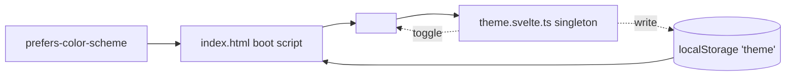

# i18n & Theming

BlockQuiz ships in German and English with all author-visible content
localized on a per-record basis. The locale a learner sees is decided by
the server *before* the first byte is rendered, then takes over on the
client as a runes-backed singleton. The theme (light/dark) follows a
similar pattern: the inline boot script in `app.html` applies the right
`data-theme` before any Svelte code runs, so the page never flashes the
wrong palette.

## Locale resolution

```mermaid
sequenceDiagram
  participant Browser
  participant Server as hooks.server.ts
  participant Locale as src/lib/server/locale.ts
  participant Layout as +layout.server.ts
  participant Page as +layout.svelte
  participant I18N as src/lib/i18n/index.svelte.ts

  Browser->>Server: HTTP request (Cookie: i18n-locale=de; Accept-Language: en;q=0.9)
  Server->>Locale: getRequestLocale(event)
  Locale-->>Server: 'de' (cookie wins)
  Server->>Page: resolve(event) with transformPageChunk replacing %lang% → 'de'
  Server->>Layout: load returns { locale: 'de' }
  Page->>I18N: await init({ initialLocale: 'de', fallbackLocale: 'en' })
  I18N->>I18N: bootstrap dict, set cookie, set <html lang>
  I18N-->>Page: ready
  Page-->>Browser: hydrated HTML in DE
```

### Server side

`getRequestLocale` (`src/lib/server/locale.ts:23`) checks the `i18n-locale`
cookie first; if it's missing or unknown it parses `Accept-Language` and
returns the first supported match. Supported locales are `'en'` and `'de'`;
the default is `'en'`.

There are two consumers in the request path:

- `+layout.server.ts` returns `{ locale }` from `load`, which becomes
  `data.locale` in `+layout.svelte`.
- `hooks.server.ts:30` composes a `transformPageChunk` that rewrites the
  `%lang%` placeholder in `src/app.html:2` so the initial HTML has the
  right `<html lang="…">` attribute on the very first render. This matters
  for screen readers and for the browser's hyphenation/spell-check
  defaults.

### Client side

`src/lib/i18n/index.svelte.ts` is a thin runes-backed singleton. The
interesting pieces:

- `$state.raw` for `currentLocaleDict`, `fallbackLocaleDict`, `localeMap` —
  raw because the dictionaries are large objects whose internal structure
  shouldn't be deep-tracked.
- `$derived.by` for `mergedLocaleDict` — clones the fallback dict, walks the
  current dict and overrides keys that exist. Translators can leave keys
  out of `de.json` and they'll fall through to `en.json` without an
  application change.
- An `I18n` proxy whose `get` traps return dictionary keys directly, so
  templates can write `i18n.player_no_code` instead of `i18n.t('player_no_code')`.
- The cookie/`document.documentElement.lang` are updated whenever
  `setLocale` runs, so subsequent server requests pick up the change.
- A small navigator-derived locale guess (`deriveLocaleFromNavigator`) is
  the last fallback, used only when there's no cookie and no
  Accept-Language match.

### Content vs. UI strings

The codebase has *two* kinds of localized data and they're handled
differently:

| Kind | Lives in | Looked up via | Falls back via |
| --- | --- | --- | --- |
| UI labels ("Run", "Reset") | `en.json` / `de.json` | `i18n.<key>` | merged dict (DE overrides EN keys) |
| Content (titles, descriptions, hints) | `LocalizedString = { de, en }` in DB | `getLocalized(value, locale, fallback)` | the other locale's value if the primary is blank |

UI labels are translator-friendly and can be missing without breaking the
app; content is author-friendly and uses *value* fallback (not key
fallback). A partially translated exercise still renders in *some*
language.

### Static-site quirks worth knowing

- `i18n-parity.spec.ts` ensures the EN and DE dictionaries cover the same
  keys. If a developer adds a key to one without the other, CI breaks.
- The merge walker is recursive over nested objects, so namespaced keys
  (`player.no_code`) work alongside flat ones. The dictionaries today are
  flat, but the support is there.
- `setCookieLocale` uses `SameSite=Lax; max-age=31536000`. A long max-age
  means returning learners get their preferred language without a reset.

## Theming

`src/lib/theme.svelte.ts` provides a singleton with `current`, `isDark`,
`set`, `toggle`, and `sync`. The DOM contract is:
`<html data-theme="light|dark">`. Tailwind's theme tokens are wired against
that attribute via CSS variables in `src/lib/app.css`.

### Avoiding a flash of incorrect theme

The boot script in `src/app.html:6` runs before Svelte hydrates:

```html
<script>
  (function () {
    try {
      var stored = localStorage.getItem('theme');
      var prefersDark = window.matchMedia('(prefers-color-scheme: dark)').matches;
      var theme = stored === 'dark' || stored === 'light' ? stored : prefersDark ? 'dark' : 'light';
      document.documentElement.setAttribute('data-theme', theme);
    } catch (e) {
      document.documentElement.setAttribute('data-theme', 'light');
    }
  })();
</script>
```

Three things to note:

- It's the *only* inline script in the document, which is why
  `script-src 'self' 'unsafe-inline'` is in the CSP (see
  [auth-and-security.md](./auth-and-security.md)). Removing it would
  require an SSR-rendered class or attribute and would still suffer a
  one-frame flash on browsers that compute theme client-side.
- It honours `prefers-color-scheme` only if no theme is in `localStorage`,
  so explicit user choice always wins over the OS preference.
- It is intentionally written in ES3 (`var`, no arrow functions, `try`
  with no parameter binding) so it works on any browser that loads the
  page at all — including older school-network proxies that strip
  ES2017+ syntax.

The Svelte side (`theme.svelte.ts:5`) reads the *current* attribute on
load so the runes state agrees with what the boot script applied; it
re-applies the attribute and writes `localStorage` on each `set`/`toggle`.
There is a `sync()` method for cases where another tab changed the theme
(e.g. multi-window classrooms) — it can be wired to a `storage` event.



## Code readout localization

The block-by-block readout shown next to the workspace uses its own
locale-tagged translation table (`src/lib/blockly/codeReadout.ts:183`)
rather than `i18n.<key>`. Why duplicate?

- The readout's strings depend on block-typed *parameters* (e.g.
  `repeat(n)`), which the i18n store's flat dict doesn't model.
- Bundling them with the parser keeps the parser self-contained and
  testable.

The table is small (~30 entries times two locales) so the cost is low.

## Server-rendered locale-aware HTML

Because the server already knows the locale, two pieces of HTML are
templated server-side:

- `<html lang="…">` via `%lang%` placeholder replacement.
- The `Loading.svelte`-style first-paint fallbacks (where present) write
  text that's locale-neutral, so they remain correct regardless of which
  language wins.

The benefit shows up in two situations:

- Search engines and embedding tools that read the lang attribute get the
  right value.
- Screen readers announce the page in the correct language from the very
  first frame.

## Pitfalls and how the code dodges them

- **Re-entrant init**: `initI18n` and `init` both guard against the
  fallback locale not being registered yet and fall back to `'en'`.
- **Locale flip mid-session**: `setLocale` updates the rune *and* the
  cookie. The next server request agrees with the client state.
- **Empty strings vs missing translations**: `getLocalized` treats empty
  strings as missing, so an author who deletes the German content of an
  exercise gets English instead of a blank line.
- **`structuredClone` on dictionaries**: the merger uses
  `structuredClone(fallbackLocaleDict)` so we never mutate the original
  reference — critical because the fallback dict is reused across many
  derive computations.
