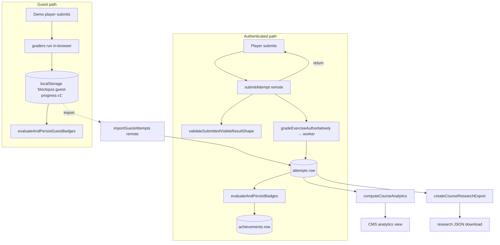
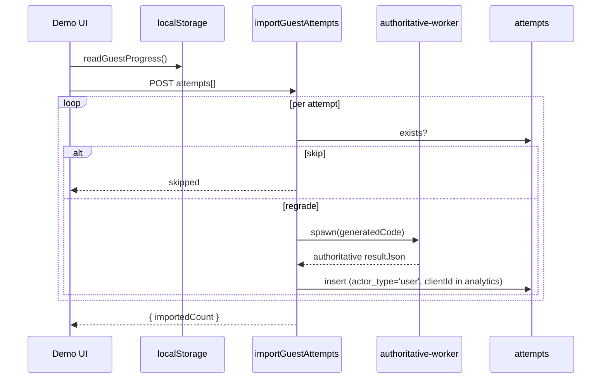
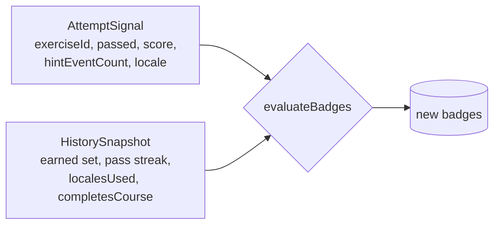

# Attempts, Progress, Badges & Analytics

Every solve a learner makes produces an *attempt*. From that single fact
the rest of the user-facing progress surface is derived: course completion
rings, recently passed exercises, replayable last-runs, awarded badges,
the teacher's analytics dashboard, and the pseudonymous research export.
This document walks the data flow end-to-end and explains the *guest*
path that runs entirely in `localStorage`.

## End-to-end view



The interesting boundary: the *authenticated* path never trusts the
browser-grading result, but the *guest* path is purely client-side. When a
guest later signs in, they can import their `localStorage` attempts; the
import path *re-grades* each attempt on the server before persisting it.

## Attempt actor invariant

`attempts` rows have three fields about *who* submitted: `user_id`,
`client_id`, and `actor_type`. Exactly one of `user_id` and `client_id`
must be set, and the value must match `actor_type`. This is enforced in
two places that *both* must agree:

- **SQLite CHECK constraint** at table create time
  (`src/lib/server/db/schema.ts:174`):

  ```sql
  CHECK ((actor_type = 'user' AND user_id IS NOT NULL AND client_id IS NULL)
      OR (actor_type = 'guest' AND user_id IS NULL AND client_id IS NOT NULL))
  ```

- **Application-level validator** before every insert
  (`src/lib/attempts/invariants.ts:9`).

Why both? The CHECK catches the cases an unhappy code path might still
attempt — e.g. a future migration accidentally writing `null/null`. The
app-level check produces a clean exception with a useful message during
development. `db:verify` (`scripts/verify-db.ts`) exercises the constraint
as part of its idempotency run, so a regression that loosens it shows up
in CI.

## Authenticated submission

`submitAttempt` in `src/lib/remote/courses.remote.ts:632` is the canonical
flow. It does the following in order:

1. `requireAuth()` — must be a signed-in user.
2. Fetch the exercise; require `published` and not `archivedAt`.
3. Confirm at least one of the exercise's courses is in the user's
   `course_users` allowlist; otherwise 403.
4. `canonicalizeExercise(row)` to get the typed Exercise.
5. `validateSubmittedVisibleResultShape(exercise, resultJson)` — shape
   check on the *visible* portion of the grading payload.
6. Sanitize `hintEventsJson` and `analyticsJson` against Zod schemas
   (silently fall back to empty defaults if malformed).
7. `gradeExerciseAuthoritatively(exercise, generatedCode)` — server-side
   re-grade. This is the authoritative result. If it throws, return 400.
8. `validateAttemptActorFields({ userId, clientId: null, actorType: 'user' })`
   before insert.
9. Insert the row with the authoritative `result_json`, `score`, `passed`,
   plus the user-supplied workspace XML, generated code, and analytics
   metadata.
10. `evaluateAndPersistBadges` — see [Badges](#badges) below.
11. Return `{ id, grading, resultJson, newBadges }`.

Because the server *always* overrides `result_json` and `score` with the
authoritative values, a maliciously forged client cannot inflate a
learner's progress.

## Guest progress (localStorage)

For `/demo`, attempts never reach the server. `src/lib/guest-progress/storage.ts`
implements a self-contained store in `localStorage` under the key
`blockquiz.guest-progress.v1`. The shape:

```ts
type GuestProgressExport = {
  version: 1;
  clientId: string;            // random UUID, stable per device
  exportedAt: number;          // last persist time
  courses: GuestCourseProgress[];
  attempts: GuestAttemptSnapshot[];
  badges?: GuestBadgeRecord[];
};
```

Reads and writes always go through `sanitizeGuestProgress` →
`normalizeGuestProgress`, which:

- guarantees the `clientId` exists,
- recomputes `bestScore`, `passed`, `attemptCount`, `completedCount`,
  `progress` (%), and `lastAttempt…` fields for every course based on the
  attempts array,
- stable-sorts attempts by `createdAt` then by id.

This means the derived fields can never drift from the underlying attempts
list — the merge function is the single source of truth.

### Badges in the guest path

`evaluateAndPersistGuestBadges` (same file) mirrors the server-side badge
evaluator. It uses the *same pure rules engine*
(`src/lib/achievements/rules.ts`), feeding it a history snapshot it builds
from the local attempts. Newly earned badges are appended to
`progress.badges` and returned to the caller for the unlock toast.

### Importing guest progress after sign-in

The demo UI offers a one-click "I have an account, import my progress"
action. It calls `importGuestAttempts` (`courses.remote.ts:735`) with the
attempts array from `localStorage`. The remote then:

- Skips attempts whose `id` already exists for this user (idempotent
  re-imports).
- For each remaining attempt, fetches the exercise, re-grades the stored
  `generatedCode` via the same authoritative worker, and inserts a fresh
  row stamped `actorType: 'user'`. The original `clientId` is preserved in
  the `analyticsJson.importedFromGuest` field for forensics.
- Writes an audit log entry (`'guest.import'`) recording the counts.



The deliberate non-feature here: imported attempts are *not* automatically
re-checked against the latest exercise definition. They use the snapshot
of the exercise that exists at import time. If an exercise has been edited
in a breaking way since the guest solved it, the import may produce a
different `score`/`passed` than the original local result. That trade-off
is intentional: the server's snapshot is the truth, and the alternative
(preserving the guest's stale grading) would violate the "server is
authoritative" invariant.

## Badges

`src/lib/achievements/rules.ts` is a *pure* function `evaluateBadges` that
takes an `AttemptSignal` (the just-landed attempt) and a `HistorySnapshot`
(what the learner has done so far) and returns the set of newly earned
`BadgeKey`s.



Badge keys and their triggers:

| Key | Trigger |
| --- | --- |
| `first_solve` | First passing attempt ever |
| `perfect_score` | A passing attempt with score == 100 |
| `no_hints` | Passing attempt with zero hint events |
| `streak_3` / `streak_5` / `streak_10` | Current pass streak ≥ N |
| `course_complete` | This attempt completes every exercise of *some* assigned course |
| `polyglot` | Has passing attempts in both DE and EN |

The rules engine is *only* the rules. The two callers
(`evaluateAndPersistBadges` on the server,
`evaluateAndPersistGuestBadges` in `localStorage`) provide identical inputs
shaped differently, so the same set of rules drives both experiences.

The pedagogical framing — competence (first solve, perfect score),
autonomy (no hints), relatedness/breadth (polyglot, course complete) — is
loosely grounded in Self-Determination Theory (Deci & Ryan 2000). The
inline comment in `rules.ts:8` records the reference; the badge metadata
(localized titles/descriptions, icons) lives in
`src/lib/achievements/meta.ts`.

`HistorySnapshot.completesCourse` is *true* only when, *after* this
attempt, every exercise of at least one course the learner is enrolled in
has at least one passing attempt. The server computes this by selecting
all passing attempt exercise ids and intersecting against the course's
exercise list (`evaluate.ts:46`). It is intentionally a single boolean
because awarding more than one `course_complete` badge in one transaction
would be confusing.

## Course progress query

`getCourseProgress` (`courses.remote.ts:414`) returns the shape the player
needs to render a course's per-exercise rings:

```ts
{
  courseId,
  exerciseIds: string[],
  exerciseProgress: Record<exerciseId, {
    bestScore, passed, attemptCount, lastAttemptId, lastAttemptAt
  }>,
  completedCount, exerciseCount, progress, // overall %
  lastExerciseId, lastExerciseIndex        // where to resume
}
```

`exerciseProgress` is derived from a single `select` over `attempts`
filtered by user id and course-assigned exercise ids; the aggregation
happens in Drizzle. The guest equivalent runs the same shape derivation in
JavaScript inside `recomputeGuestCourseProgress`.

## Course analytics (teacher view)

The CMS analytics view is driven by `computeCourseAnalytics`
(`src/lib/analytics/course-analytics.ts:53`). It receives:

- the course's exercise ids,
- *all* attempt rows for those exercises,
- the exercise rows for title/type metadata,
- two helper functions (`countHintEvents`, `parseAttemptAnalytics`) injected
  by the remote function so the analytics module itself doesn't have to
  import Zod.

For each exercise it computes:

- `attempts`, `students`, `passRate`, `avgScore`,
- average `workspaceBlockCount` and `generatedCodeLength` from the
  analytics blobs (skipping rows that don't have them, so older attempts
  don't taint averages),
- total `hintUsageCount`,
- `avgDurationMs` from `endedAt - startedAt`,
- per-locale attempt counts.

Course-wide totals (the dashboard's top row) are aggregated across all
exercises.

`students` counts *distinct* `userId || clientId`, so a teacher's view of a
course that mixes authenticated and guest attempts shows the right number
of unique people even though they live in different actor namespaces. This
is also why every count uses `Set` of `userId ?? clientId ?? ''` rather
than a SQL `COUNT(DISTINCT)`.

## Research export

The research export
(`src/lib/analytics/research-export.ts:112`) is intended for thesis-level
analysis where the analyst should not be able to re-identify learners.

It pseudonymizes both the attempt id and the participant identifier
(`{actorType}:{userId or clientId}`) using SHA-256 with a *course-scoped*
salt:

```ts
async function pseudonymizeResearchId(scope, value, prefix) {
  const digest = await crypto.subtle.digest(
    'SHA-256',
    new TextEncoder().encode(`${scope}:${value}`)
  );
  return `${prefix}-${toHex(digest).slice(0, 24)}`;
}
```

Scope is `course:${courseId}`. Two consequences:

- A participant in two different courses cannot be linked across courses
  without the original ids — the same `userId` produces two distinct
  pseudonyms.
- A participant's attempts *within* a course are linkable (they all share
  the same `participantPseudonym`), which is exactly what research
  questions about learner trajectories need.

The export also strips the workspace XML, the generated code, and the full
`result_json`. It keeps only structured numeric fields: score, passed,
locale, duration, hint usage, totals, blocks/code-length. This balances
"useful for research" against "no source code or PII leaks". Authors who
need the raw attempt data can use `exportCourseAttempts` from the same
remote module (admin-only export, no pseudonymization).

## Analytics JSON schema

`attempts.analyticsJson` is a small *forward-compatible* blob:

```ts
{
  exerciseType: 'io' | 'turtle' | 'robot',
  totalTests: number,
  passedTests: number,
  hintUsageCount: number,
  submittedAt: number,
  workspaceBlockCount?: number,
  generatedCodeLength?: number,
  importedFromGuest?: { clientId, importedAt }
}
```

Schema is enforced at *write* time by `attemptAnalyticsSchema`
(`courses.remote.ts:64`). Reading from older rows that lack newer fields
is safe because `numberOrNull`-style getters never throw.

## Audit log surface for progress

These actions write audit log rows:

- `'guest.import'` — counts of imported / submitted / skipped guest
  attempts.
- (Course publish, exercise restore, role change, etc. — out of scope here;
  see `auth-and-security.md`.)

The audit log is intentionally separate from the attempt analytics: it is
the *teacher/admin*'s view of "what happened", whereas analytics is the
research/dashboard view of "what learners did". Same database, separate
tables (`audit_logs`).

## Cross-references

- The grading the attempt insert depends on →
  [sandbox-and-grading.md](./sandbox-and-grading.md).
- The role check that gates the CMS analytics view →
  [auth-and-security.md](./auth-and-security.md).
- The schema of the `attempts` table → [exercises-and-content.md](./exercises-and-content.md#tables-in-scope).
