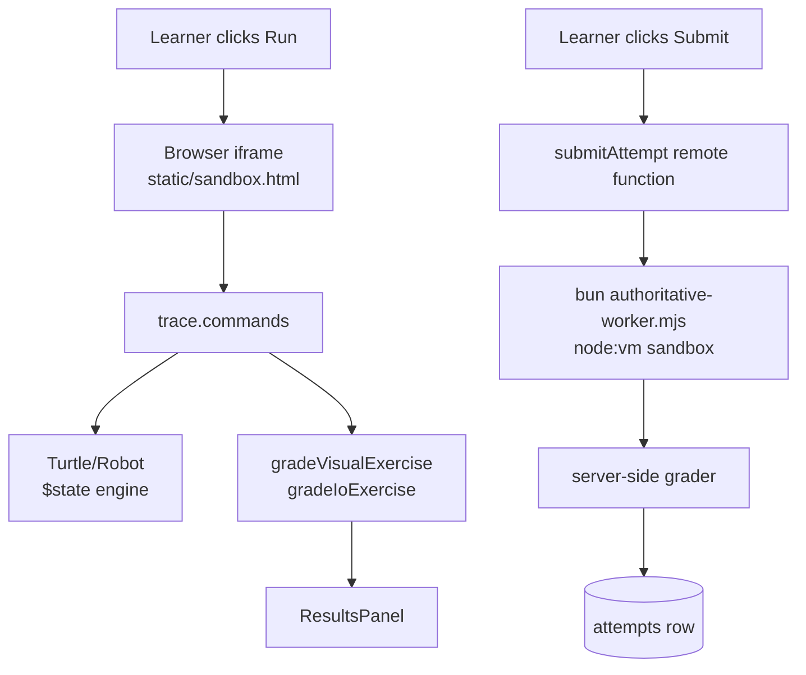
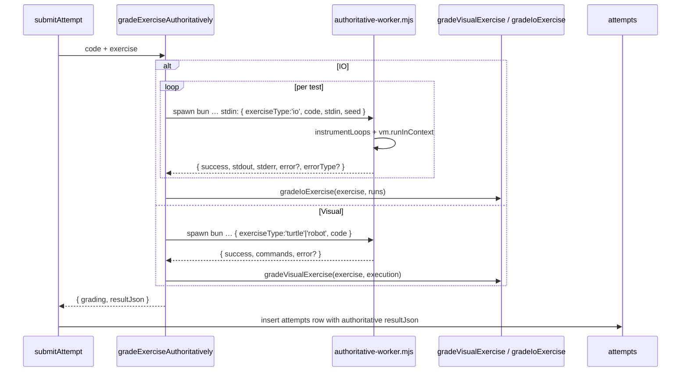

# Sandbox & Grading

The grading subsystem is the technical heart of BlockQuiz. It runs
learner-generated JavaScript inside a sandbox, captures a *trace* of what
that code did (output lines, draw commands, final position), and grades the
trace against authored test cases. Every submission is graded *twice*: once
in the browser for snappy UX, and once on the server as the authority for
what gets written to the `attempts` table.

This document explains both halves, the wire protocol between them, and the
limits/quirks that ensure a stray learner program cannot lock up the browser
or the server.

## Why two sandboxes?

The browser sandbox lets the learner press *Run* and see the turtle move in
~50 ms. But anything that came out of the learner's browser is
self-reported: the same `result_json` that says "passed all 5 tests" could
be forged with curl. So we re-run the *generated code* (not the workspace
XML, not the visible result) on the server before storing the attempt.



The two sandboxes share the exact same instrumentation logic
(`instrumentLoops`, the `tick` limiter, the blocked-globals list, the
command counter) — see *Why duplicate the runtime?* below.

## Generated code: where it comes from

Each Blockly block has a JavaScript generator registered in
`src/lib/blockly/BlocklyFactory.ts:47`. The generator emits **calls into a
single `api` object**:

```js
api.move(5);
api.turn(90);
api.color('#ff0000');
```

That `api` is provided by the sandbox at runtime. The sandbox owns the
methods; the learner's code can only invoke them. There are no global
turtle functions and no closure over the engine instance. This indirection
matters because it lets the *same generated code* run in:

- the browser iframe (with `api` wired to the visual engine for replay),
- the server worker (with `api` wired to a command-recording stub),
- a Vitest unit test (with `api` swapped for any test double).

For IO exercises the generated code uses `print(...)` / `prompt()` instead
— provided by the same boundary.

## The browser iframe sandbox

### Loading and handshake

`SandboxExecutor` (`src/lib/sandbox/SandboxExecutor.ts:48`) creates a single
hidden iframe pointing at `/sandbox.html`. The iframe is set up with
`sandbox="allow-scripts"`, which:

- gives it a `null` origin (so its `postMessage` events are easy to filter),
- explicitly *omits* `allow-same-origin`, so it cannot reach back into
  `window.parent`, cookies, or storage from the host.

After the iframe loads, the parent posts a `connect` message with a
`MessagePort` and a fresh channel id; the iframe replies with a `ready`
message bound to that same channel id. From then on, all messages flow over
the port instead of `window.postMessage`. That gives a clear "channel
established" handshake plus an easy way to ignore stray messages from
extensions or other tabs.

```mermaid
sequenceDiagram
  participant Parent as SandboxExecutor
  participant IFrame as static/sandbox.html

  Parent->>IFrame: iframe = createElement('iframe'); src=/sandbox.html
  IFrame->>Parent: window 'message' { connect } via window.postMessage
  Parent->>IFrame: ports[0] (MessagePort), channelId, parentOrigin
  IFrame-->>Parent: 'ready' (origin === 'null', channelId match)
  loop per submission
    Parent->>IFrame: 'execute' { code, exerciseType, apiMethods, limits }
    IFrame->>IFrame: instrumentLoops + new Function(...).call(...)
    IFrame-->>Parent: 'result' { success, trace, error?, errorType? }
  end
```

Why a `MessagePort` and not raw `window.postMessage`? Three reasons:

1. The port is opaque — extensions and other tabs don't see it.
2. The handshake binds the channel to one specific iframe load; if the
   sandbox is destroyed and recreated, the old `channelId` is rejected.
3. We can `controlPort.close()` on destroy, which detaches everything
   atomically. `removeEventListener` on bare window listeners is
   error-prone in comparison.

The parent enforces a slightly looser timeout (`request.timeout + 250 ms`)
than the iframe's own timeout. The buffer exists so the iframe always wins
the race and reports a structured `errorType: 'timeout'` instead of the
parent silently force-resolving. See `SandboxExecutor.ts:73`.

### Code instrumentation: the `tick` trap

The sandbox cannot rely on `setTimeout`/`AbortController` to cancel
synchronous user code. Instead, it rewrites every loop construct to inject
a `tick()` call *before each iteration*:

```js
// Before
while (condition) { … }
for (let i = 0; i < n; i++) { … }
do { … } while (cond);

// After (illustrative; tickName is randomized per run)
while (__sandboxTick_abcdef(), condition) { … }
for (let i = 0; __sandboxTick_abcdef(), (i < n); i++) { … }
do { __sandboxTick_abcdef(); … } while (cond);
```

`tick()` does two things on every call (`static/sandbox.html:239`):

- bumps an iteration counter; throws `LOOP_LIMIT` if it exceeds
  `maxIterations` (default 10 000),
- compares `performance.now() - startedAt` against the timeout; throws
  `TIMEOUT` past the budget.

The regex transformation is intentionally narrow — it covers the loop forms
Blockly's JavaScript generator can actually emit. The instrumentation logic
is duplicated *verbatim* in `src/lib/sandbox/runtime.ts:35` so the same
strings can be reused by unit tests; the source of truth is the inline
script in `sandbox.html` because that string never leaves the file at
runtime.

There is *no* attempt to defeat sufficiently adversarial code (`Promise`
microtasks, generator tricks, etc.) — the threat model is "a 10-year-old
accidentally writes `while (true)`", not "a motivated attacker probes the
sandbox". For attacker-grade isolation we would need a Worker plus
`navigator.serviceWorker` or a server-side container, which is called out
as future work.

### Blocked globals

The sandbox cannot fully remove globals (the iframe is a real browser
context) but it can shadow the ones we care about. Both runtimes wrap the
user code in a `Function` (browser) or `vm.Script` (server) call whose
parameter list re-declares globals as `undefined`:

```text
fetch, XMLHttpRequest, WebSocket, localStorage, sessionStorage, indexedDB,
document, parent, top, opener, frames, importScripts, Worker, SharedWorker,
ServiceWorker, navigator, location, history, open, close, postMessage
```

Any reference inside the user code resolves to the parameter binding, which
is `undefined` (browser) or a throwing function (server worker). The
function body runs in `"use strict"` so writing to those names would throw
`ReferenceError` anyway.

### Command recording and limits

The sandbox builds an `api` object whose keys come from the
`apiMethods: string[]` list in the execute message — the iframe doesn't
know what a "turtle" is, only that it should record `move(5)`. Each invocation:

- bumps a counter; throws `COMMAND_LIMIT` past `maxCommands` (default 10
  000),
- appends `{ type, args, timestamp }` to `trace.commands`,
- updates a *visual state* used to compute `trace.finalState` (this is the
  iframe's own forward simulation; the host-side engine independently
  re-applies the commands).

For IO exercises the sandbox provides `print`, `prompt`, and a `console`
shim that pushes into `trace.prints` and `trace.stdout`. There is no
real-time stdin: the prompt cursor just walks down the lines of the
preloaded `stdin` string.

### Error normalization

Errors thrown inside the iframe are normalized into one of five
`SandboxErrorType`s — `timeout | loop | command_limit | runtime | security`
— in `src/lib/sandbox/runtime.ts:49`. The user-facing copy lives in
`toUserFacingExecutionError` so the messages can be reused by toasts,
result panels, and the server-side path.

## The server-side worker

`gradeExerciseAuthoritatively` in
`src/lib/server/authoritative-execution.ts:160` is the one entry point used
by `submitAttempt` and by guest-attempt import (`courses.remote.ts:735`). It
spawns `scripts/authoritative-worker.mjs` per submission. For IO exercises
the worker is invoked *once per test case* with that test's `stdin`; for
visual exercises it is invoked once.



Why spawn a child process at all (instead of using `vm.Script` inline)?

- A killed child cannot leave a tangled state in the SvelteKit server. The
  parent registers a `SIGKILL` after `timeout + 2 s`
  (`HARD_TIMEOUT_BUFFER_MS` in `authoritative-execution.ts:54`) so even a
  runaway native-side hang doesn't block the request thread.
- We cap `stdout` at 1 MiB (`MAX_OUTPUT_BYTES`) and kill the child if it
  exceeds that, before we ever try to `JSON.parse` it.
- The worker output is then validated with a Zod schema
  (`workerOutputSchema` in `authoritative-execution.ts:38`) so a corrupt or
  attacker-shaped payload becomes a `'runtime'` error rather than a typed
  trust violation.

The worker itself (`scripts/authoritative-worker.mjs`) is intentionally a
plain ESM module without project imports. It pulls only `node:vm` and
`node:child_process`-style stdin reading so it can boot independently of
the SvelteKit build and run during unit tests.

### Why duplicate the runtime?

The same instrumentation appears in three places: `static/sandbox.html`,
`scripts/authoritative-worker.mjs`, and `src/lib/sandbox/runtime.ts`. That
is deliberate:

- `sandbox.html` ships to the browser as an isolated static file; we
  don't want it pulled through the bundler because that would make the CSP
  noisier and inline scripts harder to audit.
- The worker is launched outside the SvelteKit build because it has to
  start without any of the application's runtime dependencies.
- `runtime.ts` is the one piece *the rest of the app* imports for shared
  types and constants; it is unit-tested in isolation.

The cost of this duplication is two extra ~50-line files; the benefit is
that each surface stays self-contained and reviewable on its own. The unit
tests around `instrumentLoops` and `normalizeSandboxError` catch
divergences.

## Graders

Graders are *pure* — same inputs, same result, no I/O — and live in
`src/lib/graders/index.ts`. They run unchanged in the browser (for the
optimistic preview) and on the server (for the authoritative result).

### IO grading

`gradeIoExercise` (`graders/index.ts:146`) compares normalized `stdout`
strings. Normalization is configurable per exercise
(`IoNormalization`):

- `normalizeLineEndings` — collapses `\r\n` to `\n`,
- `decimalSeparator` — rewrites `,` to `.` for "either" or "." modes, and
  inverse for ",",
- `collapseWhitespace` — `/\s+/g` → ` `,
- `trim` — `String.prototype.trim`,
- `caseInsensitive` — `toLocaleLowerCase`.

The normalization is symmetric: both the expected output and the captured
stdout pass through the same pipeline. That makes test cases robust against
the most common kid-coding accidents (trailing newline, German "1,5" vs
"1.5", upper/lower mix) without forcing authors to write regex.

### Visual grading

For Turtle and Robot exercises the grader re-simulates the commands using
the *exercise config's geometry* (canvas size, grid size, start position,
direction). The re-simulation is intentional: the browser engine has live
state (e.g. an in-progress wall collision) that the server can't trust, so
the grader rolls its own state machine from the canonical command stream.

Each test case is one of five shapes (see `graders/index.ts:340`):

| `type` | What it checks |
| --- | --- |
| `target` | Final position is within `tolerance` of the target |
| `state` | Final position *and* angle are within tolerance |
| `commands` | The exact serialized command list matches |
| `path` | Every emitted path point is within tolerance of the expected path |
| `collect` | The robot collected exactly `count` collectibles |

Tolerances default to `appleTolerance` from the grader config or
`max(10, stepSize/4)` if zero. The `commands` mode is deliberately *strict*
(JSON-equal) because it's used for "did the learner use exactly this
sequence?" style exercises where pedagogy depends on order.

For visible test cases the grader echoes the `expected` and `actual` values
into the `GraderTestResult`; for hidden tests these fields are *omitted*
(`graders/index.ts:374`), so a learner inspecting devtools can't see the
hidden answer.

### Author messages

Each test case has an optional `message` (localized). When the test passes,
that message is the encouragement the learner sees; when it fails, the
grader explains what went wrong instead (e.g. "Ended 12.3 pixels away from
the target"). This pattern is repeated in every grader branch so authors
have one consistent affordance.

## Submission shape integrity

Before the server-side worker runs, the submission's `resultJson` is
checked for *shape* compatibility with the exercise's visible test set —
not for correctness. `validateSubmittedVisibleResultShape`
(`src/lib/attempts/submission.ts:35`) enforces:

- valid JSON of the expected shape,
- one `testResults[]` entry per visible test, by id,
- no duplicates, all `visible: true`,
- counts in `totalTests` / `testResults.length` agree with the canonical
  visible-test count.

Why a shape check at all if the server is going to regrade authoritatively?
Because it catches deliberately malformed clients early and produces a
clean HTTP 400 with a meaningful message; otherwise the worker spawn and
re-grade would still run, wasting work.

The *outcome* fields (`passed`, `score`) are ignored at this stage — the
grader rewrites them based on the authoritative run. See
`courses.remote.ts:686`.

## Replay

`ExecutionState.seekToCommand`
(`src/lib/components/player/execution.svelte.ts:131`) lets the learner step
through their last successful run one command at a time. It resets the live
engine and replays the first *n* commands by dispatching them through the
engine's `api`. Two design choices keep this honest:

- It walks the *trace*, not the source code — so it cannot diverge from
  what actually executed.
- Unknown commands are skipped silently, which makes the replay
  forward-compatible if we add new block types later.

This is the same primitive the editor uses to render the path overlay; the
animation timing is owned by the `Replay` component.

## Failure modes & UX copy

| Sandbox error type | Cause | UX surface |
| --- | --- | --- |
| `timeout` | `performance.now()` budget elapsed | "Your code took too long to run…" toast |
| `loop` | `maxIterations` exceeded by the `tick` trap | "Infinite loop detected…" toast |
| `command_limit` | More than `maxCommands` API calls | "Too many commands…" toast |
| `security` | Throw from a blocked-global stub | "Your code tried to use a blocked browser API." toast |
| `runtime` | Anything else (`Error`, syntax errors, our own assertions) | The raw error message bubbled through `normalizeSandboxError` |

Wall collisions are *not* sandbox errors — they're a state on the engine
itself. `ExecutionState.handleSubmit`
(`execution.svelte.ts:296`) rewrites the grading result to fail-with-zero
when the engine reports a collision after submission, so a path-graded
exercise can't be "passed" by walking through a wall.

## Tests to read first

If you want to verify any of the claims above, the test files at
`src/lib/sandbox/sandbox.test.ts`,
`src/lib/graders/index.spec.ts`, `src/lib/graders/canvas.spec.ts`,
`src/lib/graders/turtle.spec.ts`, and
`src/lib/server/authoritative-execution.spec.ts` are short and read like a
specification.
