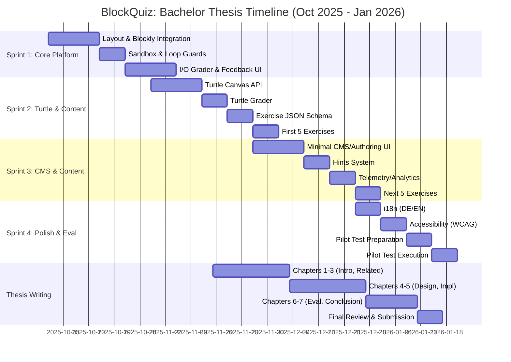

# BlockQuiz Bachelor Thesis - Gantt Chart

## Milestones

- **End of Sprint 1** (End-Oct): Working I/O exercise platform with sandbox
- **End of Sprint 2** (End-Nov): Turtle graphics + 5 exercises complete
- **End of Sprint 3** (End-Dec): CMS + 10 total exercises
- **End of Sprint 4** (Mid-Jan): MVP complete, pilot test done
- **Thesis Submission** (End-Jan 2026): Final thesis delivered

## Key Dates

- **Start Date**: October 1, 2025
- **MVP Complete**: January 15, 2026
- **Thesis Submission**: January 31, 2026
- **Duration**: ~4 months

## Notes

- Sprints overlap with thesis writing (iterative process)
- Pilot test in Sprint 4 with 6-10 children aged 8-12
- Compressed timeline: 4 months instead of 5
- All tasks streamlined to finish by end of January 2026
- Buffer time included for critical path items only
